# 界面视觉效果图 v0.1

## 状态

- status: draft
- source: 用户请求、第一阶段占位素材、最小可玩循环界面拆分
- updated: 2026-05-16

## 结论

本页是待确认的界面视觉草案，不是已确认开发结论。用户确认后，才能把本页作为后续 UI 开发的视觉目标。

## 使用素材

- 使用 `assets/ui/` 中的面板和按钮占位图。
- 使用 `assets/cards/` 中的卡框占位图。
- 使用 `assets/icons/` 中的生命、护甲、能量、金币和插槽图标。
- 使用 `assets/map/` 中的地图节点图标。
- 使用 `assets/status/` 中的敌人意图和状态图标。

## 总览

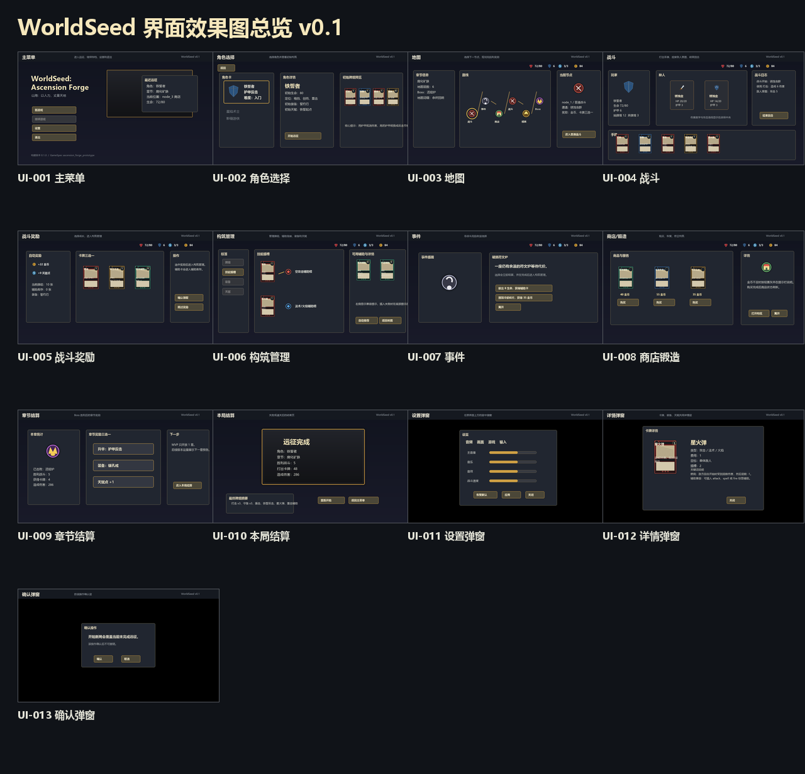

## UI-001 主菜单

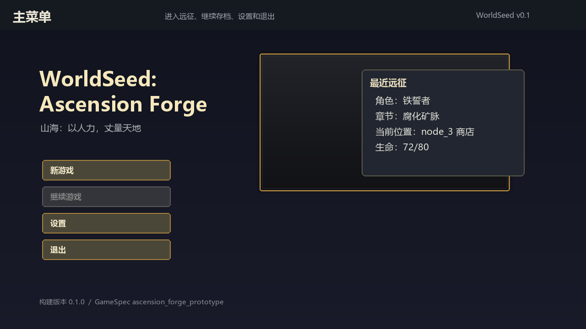

- 左侧为游戏标题、世界观短句和主按钮列表。
- 右侧保留最近远征信息面板，用于继续游戏时展示存档摘要。
- 底部展示构建版本和 GameSpec 版本。

## UI-002 角色选择

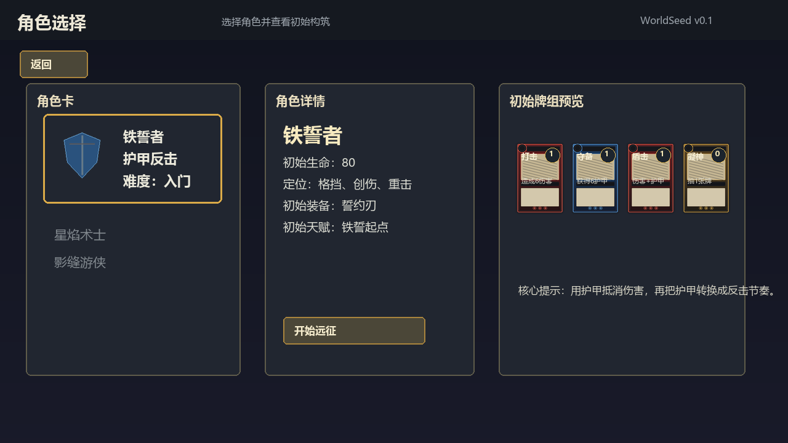

- 左侧是角色卡列表，当前选中角色高亮。
- 中央是角色详情，包括定位、生命、装备和天赋起点。
- 右侧展示初始牌组预览。
- 底部主操作是“开始远征”。

## UI-003 地图

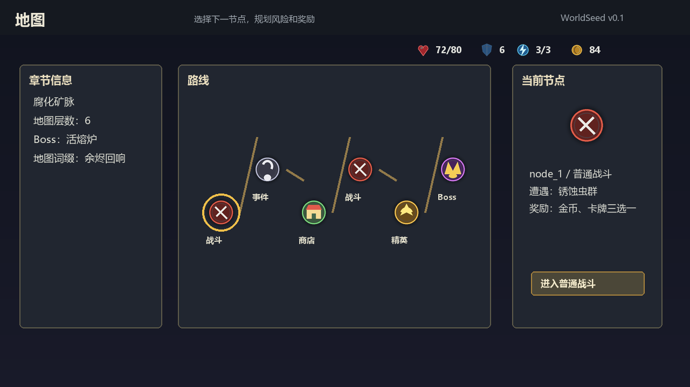

- 顶部展示生命、护甲、能量、金币等局内资源。
- 左侧是章节、Boss 和地图词缀信息。
- 中央是横向节点路线。
- 右侧是当前选中节点详情和进入按钮。

## UI-004 战斗

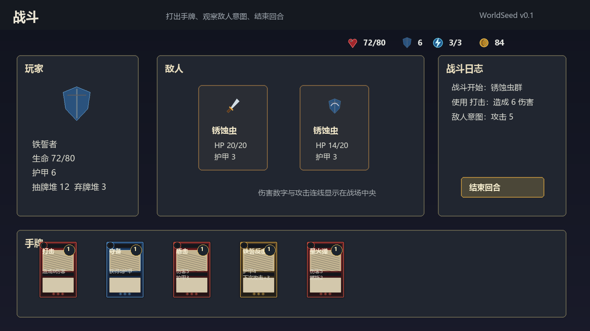

- 左侧展示玩家状态。
- 中央展示敌人、敌人意图、生命和护甲。
- 右侧展示战斗日志和结束回合按钮。
- 底部是横向手牌区，卡牌以类型卡框区分。

## UI-005 战斗奖励

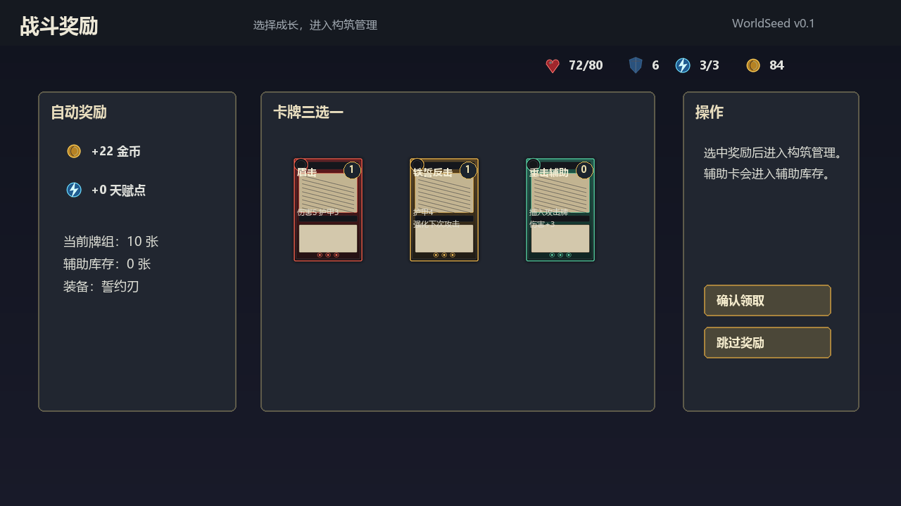

- 左侧展示自动获得的金币、天赋点和当前构筑摘要。
- 中央展示三选一卡牌或辅助奖励。
- 右侧展示确认领取、跳过奖励等操作。

## UI-006 构筑管理

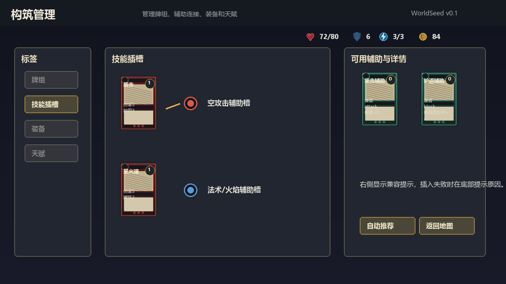

- 左侧是构筑页签：牌组、技能插槽、装备、天赋。
- 中央展示当前技能卡和插槽连接关系。
- 右侧展示可用辅助卡与详情。
- 底部操作包含自动推荐和返回地图。

## UI-007 事件

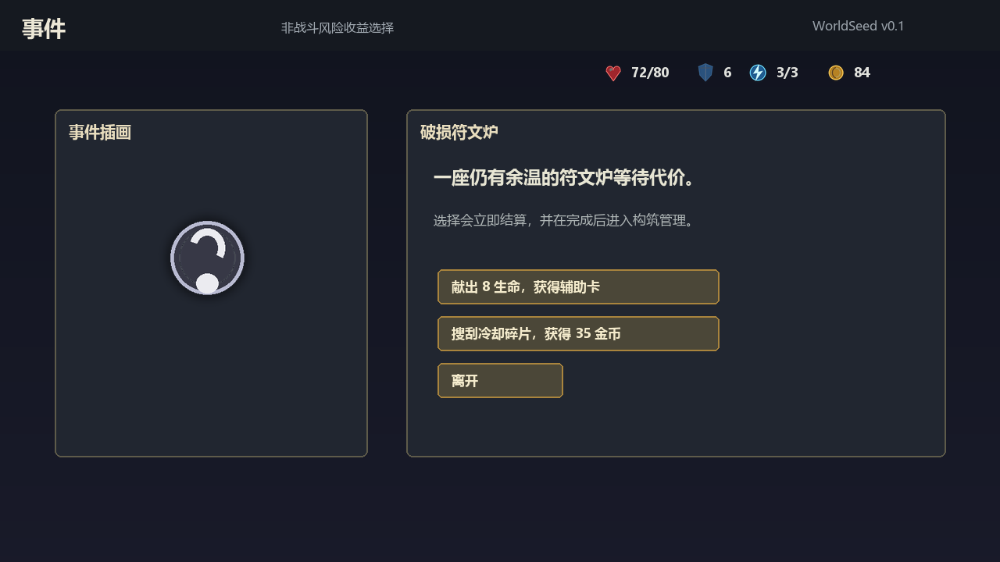

- 左侧展示事件图标或事件插画。
- 右侧展示事件标题、描述、选择项和结果方向。
- 选择后进入构筑管理界面。

## UI-008 商店/锻造

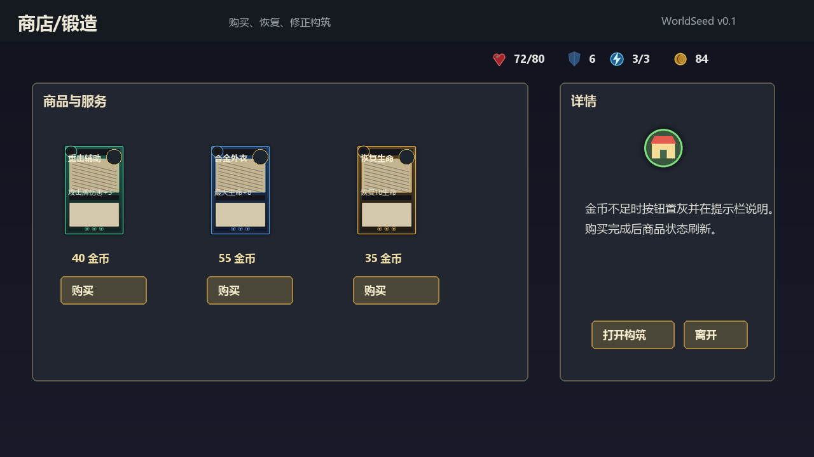

- 左侧展示商品和服务卡片。
- 每个商品卡片包含费用和购买按钮。
- 右侧展示商店详情、打开构筑和离开按钮。

## UI-009 章节结算

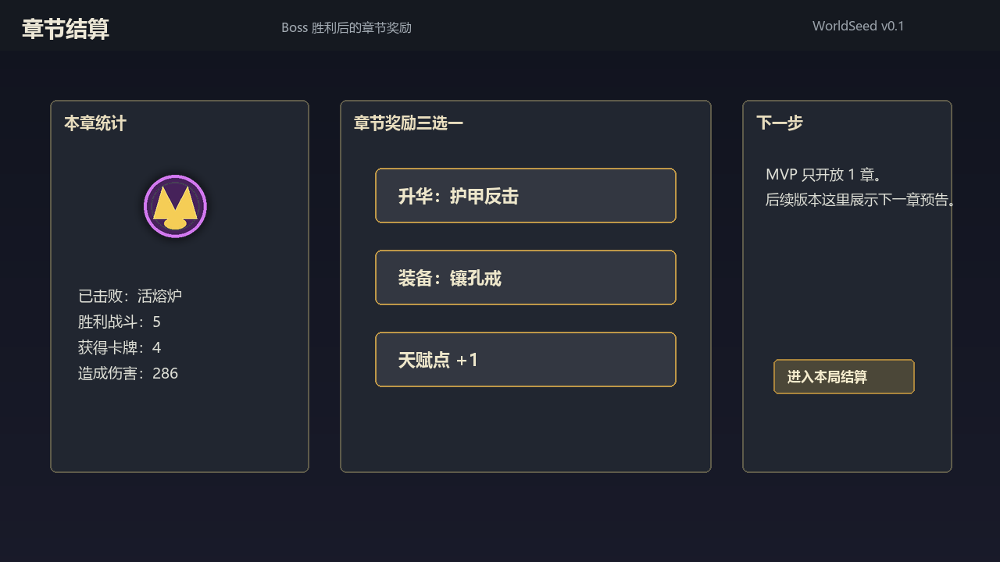

- 左侧展示 Boss 击败结果和本章统计。
- 中央展示章节奖励三选一。
- 右侧展示下一步入口。MVP 阶段进入本局结算。

## UI-010 本局结算

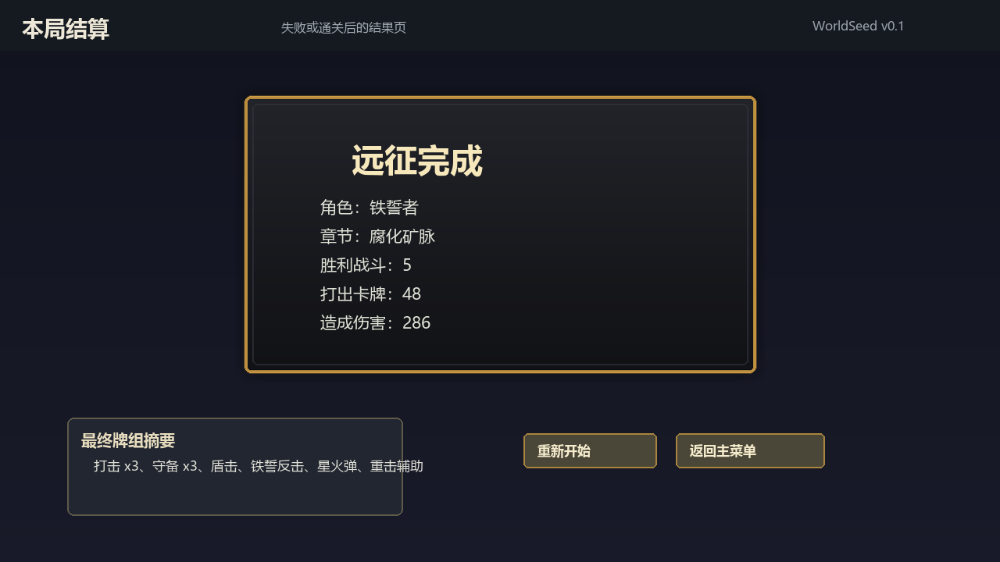

- 中央展示通关或失败结果。
- 左下展示最终牌组摘要。
- 底部展示重新开始和返回主菜单。

## UI-011 设置弹窗

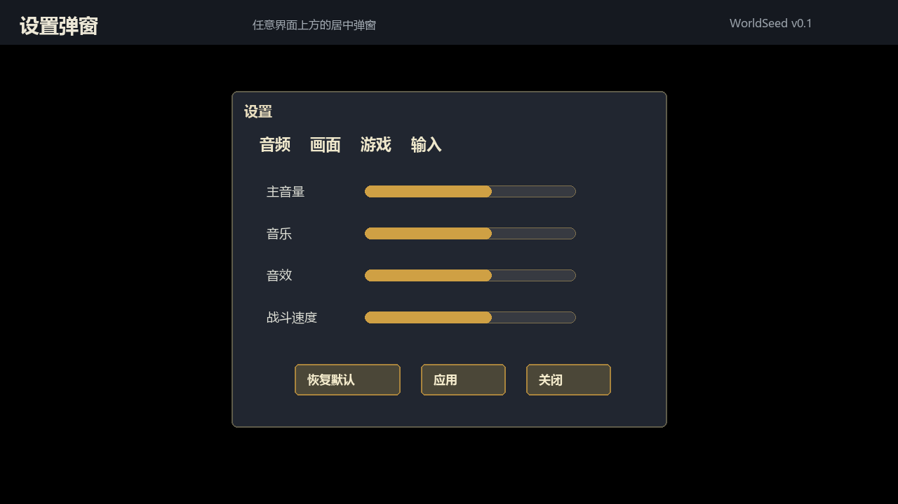

- 居中弹窗覆盖当前界面。
- 顶部使用设置分类标签。
- 主体展示音量、画面或战斗速度控件。
- 底部展示恢复默认、应用和关闭按钮。

## UI-012 详情弹窗

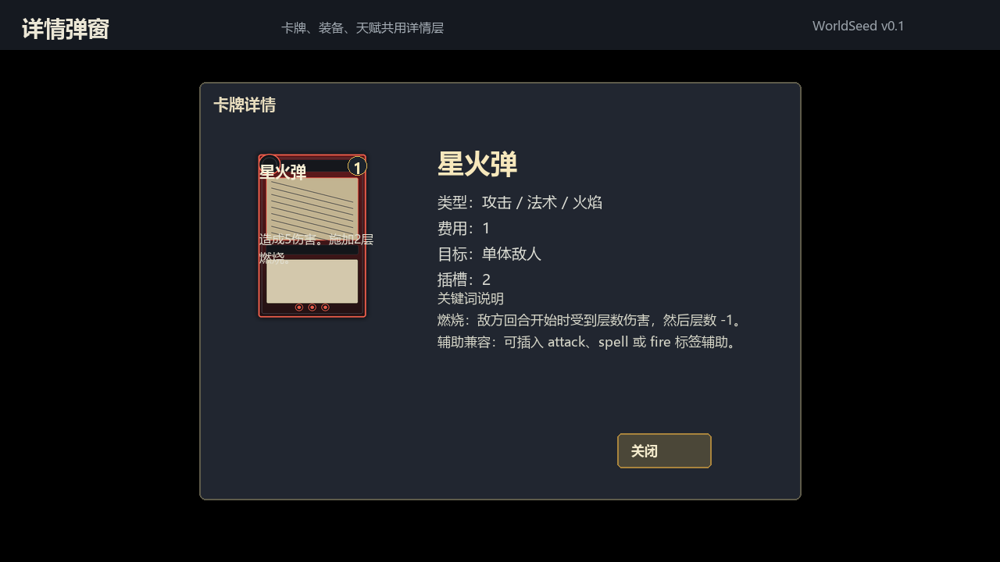

- 居中弹窗覆盖当前界面。
- 左侧展示卡牌、装备或天赋视觉。
- 右侧展示完整规则文本、标签、费用、来源和关键词解释。

## UI-013 确认弹窗

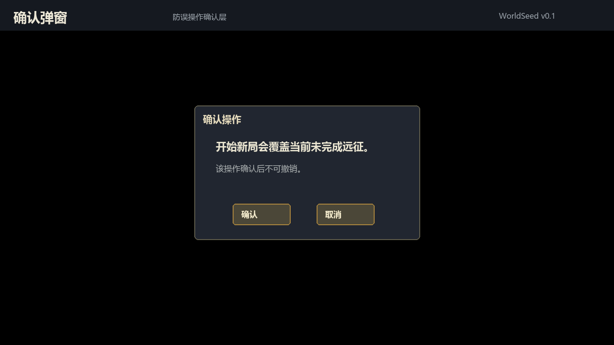

- 小型居中弹窗覆盖当前界面。
- 标题和正文必须明确说明风险。
- 底部只保留确认和取消两个操作。

## 待确认点

- 是否接受当前暗色矿脉风格作为 MVP 基础 UI 风格。
- 是否接受地图使用横向节点路线，而不是竖向爬塔路线。
- 是否接受构筑管理先以页签和面板方式承载深构筑，而不是复杂天赋盘全屏界面。
- 是否需要在进入开发前为 13 个界面补充更细的交互动效说明。

## 验证

- 效果图数量：13 个界面图 + 1 个总览图。
- 每张界面图分辨率：1280x720。
- 总览图分辨率：1280x1232。
- 效果图引用路径位于 `Experiments/EXP-001-worldseed/AIGC/wiki/design/images/ui-screen-mockups-v0.1/`。
