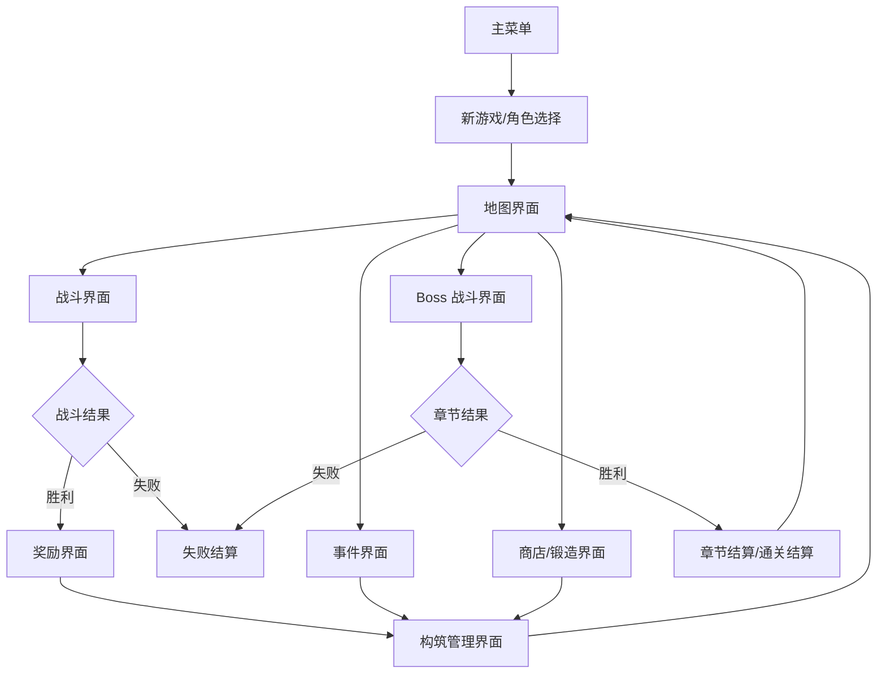

# 最小可玩循环与界面功能拆分草案

## 状态

- status: draft
- source: 用户输入、项目 wiki、第一款游戏策划方案草案会话
- updated: 2026-05-15

## 会话性质

本记录是策划讨论草案，不是已确认的正式设计结论。

本文按用户提出的方向，将第一款游戏暂定为“爬塔式 Roguelike 卡牌 + ARPG 深构筑”。参考对象只取系统结构，不复刻《杀戮尖塔 2》和《流放之路 2》的具体职业、卡牌、词条、数值和世界观。

## 目标

给出一套能实际玩起来的最小循环策划案，覆盖玩家在 MVP 中能看到的所有主要界面：

- 每个界面的整体构成元素。
- 每个界面的 UI 布局。
- 每个按钮的功能。
- 界面之间如何跳转。
- 一局游戏从开始到胜利或失败的最小闭环。

## MVP 设计原则

- 先做单人模式。
- 先做鼠标点击操作，键盘快捷键只作为补充。
- 所有数值、卡牌、敌人、地图节点、奖励、词缀和 UI 文案都必须来自 GameSpec 或配置。
- MVP 只验证一局游戏能从主菜单进入、完成至少 3 场战斗、获得奖励、调整构筑、击败章节 Boss 或失败结算。
- 不做账号、联机、图鉴、成就、创意工坊、皮肤商城、复杂后期地图。

## 最小可玩循环

MVP 的最短可玩路径：

1. 主菜单点击“新游戏”。
2. 选择 1 个角色，点击“开始远征”。
3. 地图选择一个普通战斗节点。
4. 战斗中打出卡牌，点击“结束回合”。
5. 击败敌人后进入奖励界面。
6. 选择 1 张卡或跳过奖励。
7. 进入构筑管理界面，可查看牌组、技能插槽、装备和天赋。
8. 返回地图，继续选择节点。
9. 击败章节 Boss 后进入章节结算。
10. 玩家死亡则进入失败结算。

## 全局 UI 约定

### 基础布局

以 16:9 横屏为基准。所有界面使用同一套全局结构：

- 顶部状态栏：显示当前角色、生命、金币、章节、地图层数、设置入口。
- 主内容区：当前界面的核心交互区域。
- 底部提示栏：显示当前可执行操作、错误反馈和悬停说明。
- 右上角全局按钮：设置、返回、关闭弹窗。

### 通用按钮

| 按钮 | 出现位置 | 功能 | 反馈 |
| --- | --- | --- | --- |
| 设置 | 顶部右侧 | 打开设置弹窗 | 暂停当前界面输入，弹出设置层。 |
| 返回 | 二级界面左上或右上 | 返回上一个界面 | 若存在未保存选择，先弹确认。 |
| 关闭 | 弹窗右上 | 关闭当前弹窗 | 回到弹窗前界面。 |
| 确认 | 弹窗或选择界面底部 | 提交当前选择 | 成功后跳转到目标界面。 |
| 取消 | 弹窗或选择界面底部 | 放弃当前操作 | 关闭弹窗或回到上一步。 |
| 查看详情 | 卡牌、装备、天赋悬停或点击 | 打开详情弹窗 | 展示完整规则文本和标签。 |

### 通用反馈

- 按钮可点击：正常亮度。
- 按钮不可点击：置灰，并在悬停时显示原因。
- 选择成功：按钮短暂高亮，播放确认音效。
- 无效操作：底部提示栏显示原因，例如“能量不足”“目标无效”“没有可用天赋点”。
- 关键跳转：淡入淡出，不使用长过场。

## 界面清单

MVP 玩家能进入以下界面：

| ID | 界面 | 是否必做 | 作用 |
| --- | --- | --- | --- |
| UI-001 | 主菜单 | 是 | 进入新游戏、继续游戏、设置、退出。 |
| UI-002 | 新游戏/角色选择 | 是 | 选择角色和初始构筑。 |
| UI-003 | 地图界面 | 是 | 选择下一节点。 |
| UI-004 | 战斗界面 | 是 | 进行回合制卡牌战斗。 |
| UI-005 | 战斗奖励界面 | 是 | 领取卡牌、辅助、金币、装备或天赋点。 |
| UI-006 | 构筑管理界面 | 是 | 管理牌组、技能插槽、装备、天赋。 |
| UI-007 | 事件界面 | 是 | 处理非战斗风险收益选择。 |
| UI-008 | 商店/锻造界面 | 是 | 购买、移除、升级、镶嵌。 |
| UI-009 | 章节结算界面 | 是 | 展示章节胜利、选择升华或进入下一章。 |
| UI-010 | 失败/通关结算界面 | 是 | 展示本局结果和返回入口。 |
| UI-011 | 设置弹窗 | 是 | 调整音量、显示、输入和退出本局。 |
| UI-012 | 卡牌/装备/天赋详情弹窗 | 是 | 展示完整信息。 |
| UI-013 | 确认弹窗 | 是 | 防止误操作。 |

## UI-001 主菜单

### 目标

让玩家进入一局游戏，或继续未完成的一局。

### 布局

- 背景：当前世界种子的静态或轻动画背景。
- 左侧纵向主按钮区，占屏幕左侧约 30%。
- 右侧展示区，占屏幕右侧约 60%，显示当前版本、最近一次角色剪影、世界种子名称。
- 底部小字区域显示版本号和构建时间。

### 元素

| 元素 | 位置 | 内容 |
| --- | --- | --- |
| 游戏标题 | 左上 | `WorldSeed: Ascension Forge`，工作代号可配置。 |
| 主按钮列表 | 左侧中部 | 新游戏、继续游戏、设置、退出。 |
| 最近记录卡片 | 右侧中部 | 最近角色、章节、生命、当前节点。 |
| 版本信息 | 左下 | 构建版本、配置版本、GameSpec 版本。 |

### 按钮

| 按钮 | 功能 | 可用条件 | 跳转 |
| --- | --- | --- | --- |
| 新游戏 | 创建新局 | 始终可用 | UI-002 新游戏/角色选择 |
| 继续游戏 | 读取未完成存档 | 存在有效局内存档 | UI-003 地图界面或 UI-004 战斗界面 |
| 设置 | 打开设置 | 始终可用 | UI-011 设置弹窗 |
| 退出 | 关闭游戏 | 桌面端可用 | 系统退出确认 |

### 跳转规则

- 点击“新游戏”不会立即覆盖旧存档。如果存在未完成存档，弹出 UI-013 确认弹窗。
- 点击“继续游戏”时，如果存档损坏，底部提示“存档不可用”，按钮置灰或弹错误。

## UI-002 新游戏/角色选择

### 目标

选择角色原型，并理解该角色的初始玩法。

### 布局

- 顶部状态栏：显示“新远征”标题、返回按钮。
- 左侧角色卡列表：3 张角色卡横向或纵向排列。
- 中央角色详情：展示角色立绘、生命、初始遗物、初始牌组摘要。
- 右侧初始构筑预览：技能卡、辅助卡、装备、天赋起点。
- 底部操作栏：返回、随机角色、开始远征。

### 元素

| 元素 | 内容 |
| --- | --- |
| 角色卡 | 名称、定位、难度、关键词。 |
| 角色详情 | 角色说明、初始生命、初始金币、初始遗物。 |
| 初始牌组 | 攻击、防御、核心技能卡数量。 |
| 初始技能插槽 | 当前可被辅助卡镶嵌的技能卡。 |
| 初始天赋 | 天赋盘起点和第一个可选方向。 |

### 按钮

| 按钮 | 功能 | 可用条件 | 跳转 |
| --- | --- | --- | --- |
| 返回 | 回到主菜单 | 始终可用 | UI-001 主菜单 |
| 角色卡 | 选择该角色 | 始终可用 | 停留本界面并刷新详情 |
| 查看牌组 | 打开初始牌组详情 | 已选角色 | UI-012 详情弹窗 |
| 查看天赋 | 打开初始天赋预览 | 已选角色 | UI-012 详情弹窗 |
| 随机角色 | 随机选中一个角色 | 至少 2 个角色可用 | 停留本界面并刷新详情 |
| 开始远征 | 创建本局并生成地图 | 已选角色 | UI-003 地图界面 |

### MVP 角色

| 角色 | 初始生命 | 初始玩法 | 初始关键词 |
| --- | --- | --- | --- |
| 铁誓者 | 80 | 用护甲抵消伤害，再把护甲转化为反击。 | 格挡、创伤、重击 |
| 星焰术士 | 65 | 使用火、冰、雷法术制造异常并连锁爆发。 | 点燃、冻结、感电 |
| 影缝游侠 | 70 | 用低费牌连击，叠毒并规避伤害。 | 连击、中毒、闪避 |

## UI-003 地图界面

### 目标

让玩家选择下一步风险和奖励，形成路线规划。

### 布局

- 顶部状态栏：角色头像、生命、金币、章节、层数、设置。
- 主区域：节点地图，从下到上或从左到右展开。
- 左侧信息栏：当前章节规则、地图词缀、Boss 预告。
- 右侧节点详情栏：点击节点后显示该节点类型、奖励、风险。
- 底部操作栏：打开构筑、确认前往。

### 节点类型

| 节点 | 图标 | 功能 |
| --- | --- | --- |
| 普通战斗 | 剑 | 标准战斗，给基础奖励。 |
| 精英战斗 | 骷髅冠 | 高难战斗，给更高奖励。 |
| 事件 | 问号 | 非战斗选择，可能获得或失去资源。 |
| 商店 | 钱袋 | 购买卡牌、辅助、装备，移除卡牌。 |
| 锻造 | 铁砧 | 升级卡牌、镶嵌辅助、修复生命。 |
| Boss | 章印 | 章节最终战。 |

### 按钮

| 按钮 | 功能 | 可用条件 | 跳转 |
| --- | --- | --- | --- |
| 节点按钮 | 选中一个可达节点 | 节点与当前位置连通 | 停留本界面，刷新右侧详情 |
| 确认前往 | 进入选中节点 | 已选可达节点 | 根据节点类型跳转 UI-004/UI-007/UI-008 |
| 打开构筑 | 查看并调整当前构筑 | 始终可用 | UI-006 构筑管理界面 |
| 查看 Boss | 查看 Boss 预告 | Boss 已生成 | UI-012 详情弹窗 |
| 设置 | 打开设置 | 始终可用 | UI-011 设置弹窗 |

### 跳转规则

- 普通战斗、精英战斗、Boss 节点进入 UI-004 战斗界面。
- 事件节点进入 UI-007 事件界面。
- 商店和锻造节点进入 UI-008 商店/锻造界面。
- 完成节点后回到 UI-003，当前位置移动到刚完成的节点。
- Boss 胜利后进入 UI-009 章节结算界面。

## UI-004 战斗界面

### 目标

完成一场可理解、可反馈、可胜负判定的回合制卡牌战斗。

### 布局

- 顶部状态栏：回合数、角色生命、金币、抽牌堆数量、弃牌堆数量、设置。
- 左侧玩家区：角色立绘、生命条、护甲值、状态图标、当前遗物。
- 右侧敌人区：敌人队列、生命条、护甲值、意图图标、状态图标。
- 中央战场区：攻击连线、伤害数字、状态动画。
- 底部手牌区：当前手牌横向排列。
- 底部右侧操作区：能量球、结束回合、撤销本张牌。
- 左下日志区：最近 3 条战斗事件，可折叠。

### 核心元素

| 元素 | 内容 |
| --- | --- |
| 玩家生命条 | 当前生命/最大生命，低血量时变红。 |
| 护甲值 | 本回合可抵消伤害，回合结束默认清除。 |
| 能量球 | 本回合剩余能量/最大能量。 |
| 手牌 | 卡牌名称、费用、标签、效果摘要、可用状态。 |
| 敌人意图 | 攻击、防御、强化、召唤、未知。 |
| 状态图标 | 点燃、中毒、冻结、感电、创伤、易伤等。 |
| 抽牌堆/弃牌堆 | 点击可查看牌堆列表。 |

### 卡牌交互

| 操作 | 行为 | 反馈 |
| --- | --- | --- |
| 悬停卡牌 | 放大卡牌并显示关键词说明 | 显示详情气泡。 |
| 点击卡牌 | 选中卡牌 | 可选目标高亮。 |
| 拖拽卡牌到目标 | 对目标使用卡牌 | 成功打出后进入弃牌堆或消耗区。 |
| 点击目标后确认 | 使用选中卡牌 | 适合不使用拖拽的操作方式。 |
| 右键卡牌 | 打开完整详情 | UI-012 详情弹窗。 |

### 按钮

| 按钮 | 功能 | 可用条件 | 跳转 |
| --- | --- | --- | --- |
| 结束回合 | 结束玩家回合，进入敌方行动 | 玩家回合中 | 停留战斗界面 |
| 撤销本张牌 | 撤销最近一次未结算的选牌 | 卡牌尚未造成随机或不可逆结果 | 停留战斗界面 |
| 抽牌堆 | 查看剩余抽牌 | 始终可用 | UI-012 详情弹窗 |
| 弃牌堆 | 查看弃牌 | 始终可用 | UI-012 详情弹窗 |
| 消耗区 | 查看本场已消耗卡牌 | 有消耗卡牌时可用 | UI-012 详情弹窗 |
| 敌人详情 | 查看敌人词条和意图说明 | 点击敌人头像或意图 | UI-012 详情弹窗 |
| 设置 | 打开设置 | 始终可用 | UI-011 设置弹窗 |

### 战斗流程

1. 战斗开始：抽 5 张牌，能量设为最大值。
2. 玩家回合：玩家打牌，能量不足或目标不合法时阻止操作并提示。
3. 点击结束回合：弃掉剩余手牌，敌人按意图行动。
4. 新回合：清理临时护甲和状态，抽牌，恢复能量。
5. 胜利：所有敌人生命为 0，进入 UI-005 战斗奖励界面。
6. 失败：玩家生命为 0，进入 UI-010 失败结算界面。

## UI-005 战斗奖励界面

### 目标

让玩家在战斗后获得构筑成长，并形成选择压力。

### 布局

- 顶部状态栏：胜利标题、当前生命、金币。
- 中央奖励卡区：3 张卡牌或辅助卡候选。
- 右侧额外奖励区：金币、装备、天赋点、生命恢复。
- 左侧当前构筑摘要：当前牌组数量、核心标签、装备槽状态。
- 底部操作栏：跳过、确认领取、打开构筑。

### 奖励类型

| 奖励 | 说明 |
| --- | --- |
| 卡牌奖励 | 从 3 张候选中选择 1 张加入牌组。 |
| 辅助卡奖励 | 选择 1 张辅助卡，进入构筑管理后可插入技能卡。 |
| 装备奖励 | 获得 1 件装备，替换或放入背包。 |
| 金币奖励 | 自动获得。 |
| 天赋点 | 精英或 Boss 奖励，用于构筑管理界面。 |

### 按钮

| 按钮 | 功能 | 可用条件 | 跳转 |
| --- | --- | --- | --- |
| 奖励卡 | 选中奖励 | 存在候选奖励 | 停留本界面并高亮 |
| 查看详情 | 查看完整效果 | 点击奖励右上角详情 | UI-012 详情弹窗 |
| 确认领取 | 获得选中奖励 | 已选择奖励或只有自动奖励 | UI-006 构筑管理界面 |
| 跳过 | 放弃可选卡牌奖励 | 奖励允许跳过 | UI-006 构筑管理界面 |
| 打开构筑 | 查看当前构筑再决定 | 始终可用 | UI-006 构筑管理界面，返回后仍保留奖励选择 |

### 跳转规则

- 普通战斗胜利后进入奖励界面。
- 奖励处理完成后默认进入 UI-006 构筑管理界面。
- 玩家也可在构筑管理界面点击“返回地图”，回到 UI-003。

## UI-006 构筑管理界面

### 目标

让玩家管理牌组、技能插槽、装备和天赋。这里是“ARPG 深构筑”转换为卡牌游戏的核心界面。

### 布局

- 顶部状态栏：角色、生命、金币、天赋点、返回地图。
- 左侧导航标签：牌组、技能插槽、装备、天赋。
- 中央主面板：根据标签显示具体内容。
- 右侧详情面板：显示当前选中卡牌、装备或天赋的完整说明。
- 底部操作栏：应用改动、撤销改动、返回地图。

### 标签页

| 标签 | 功能 |
| --- | --- |
| 牌组 | 查看所有卡牌，筛选攻击、防御、技能、辅助、诅咒。 |
| 技能插槽 | 把辅助卡插入符合标签的技能卡。 |
| 装备 | 管理武器、防具、饰品、圣物 4 个槽位。 |
| 天赋 | 花费天赋点解锁节点。 |

### 牌组页布局

- 中央为卡牌网格。
- 顶部有筛选条：全部、技能、辅助、装备、诅咒、已升级。
- 右侧显示选中卡牌详情。

牌组页按钮：

| 按钮 | 功能 | 可用条件 |
| --- | --- | --- |
| 筛选按钮 | 切换卡牌显示类别 | 始终可用 |
| 排序按钮 | 按费用、稀有度、获得时间排序 | 始终可用 |
| 查看详情 | 打开卡牌完整说明 | 已选卡牌 |
| 标记核心 | 给卡牌添加收藏标记 | 已选卡牌 |

### 技能插槽页布局

- 左侧显示所有技能卡。
- 中央显示选中技能卡的插槽。
- 右侧显示可用辅助卡列表。
- 底部显示兼容规则和冲突提示。

技能插槽页按钮：

| 按钮 | 功能 | 可用条件 |
| --- | --- | --- |
| 技能卡 | 选择要编辑的技能 | 技能卡存在 |
| 辅助卡 | 选择要插入的辅助 | 辅助卡存在 |
| 插入 | 将辅助卡插入技能槽 | 标签兼容且有空槽 |
| 拆下 | 从技能槽移除辅助卡 | 插槽有辅助卡 |
| 自动推荐 | 根据标签推荐插槽 | 存在可兼容辅助 |
| 清空本技能 | 移除该技能全部辅助 | 该技能有辅助 |

无效输入必须有明确反馈：

- 标签不兼容：提示“辅助卡需要 fire 或 spell 标签”。
- 插槽已满：提示“该技能没有空辅助槽”。
- 辅助唯一限制冲突：提示“该辅助已插入其他技能”。

### 装备页布局

- 左侧 4 个装备槽：武器、防具、饰品、圣物。
- 中央背包列表：当前未装备物品。
- 右侧装备详情：基础属性、词缀、影响的卡牌标签。

装备页按钮：

| 按钮 | 功能 | 可用条件 |
| --- | --- | --- |
| 装备 | 穿上选中装备 | 选中装备且槽位匹配 |
| 卸下 | 移除当前槽位装备 | 槽位有装备 |
| 对比 | 与当前装备比较 | 选中背包装备 |
| 丢弃 | 删除装备换金币或无收益 | 非锁定装备 |
| 锁定 | 防止误丢弃 | 选中装备 |

### 天赋页布局

- 中央为小型天赋盘。
- 节点以线连接，已解锁节点发光，可解锁节点高亮。
- 左侧显示剩余天赋点和当前升华方向。
- 右侧显示选中节点详情。

天赋页按钮：

| 按钮 | 功能 | 可用条件 |
| --- | --- | --- |
| 天赋节点 | 选中节点 | 始终可点击查看 |
| 解锁 | 花费 1 点解锁节点 | 节点相邻、未解锁、有天赋点 |
| 撤销本次 | 撤销本界面未应用的天赋选择 | 存在未应用改动 |
| 应用改动 | 保存本次构筑调整 | 存在改动 |
| 返回地图 | 回到地图 | 没有未应用改动，或确认放弃 |

### 跳转规则

- 从奖励界面进入时，返回目标是 UI-003 地图界面。
- 从地图界面进入时，返回目标是 UI-003 地图界面。
- 若存在未应用改动，点击返回必须弹 UI-013 确认弹窗。

## UI-007 事件界面

### 目标

提供非战斗风险收益，让玩家用当前构筑和资源做选择。

### 布局

- 顶部状态栏：事件标题、生命、金币。
- 左侧插画区：事件插画或占位图。
- 右侧文本区：事件描述、当前条件、结果预告。
- 底部选择区：2 到 3 个选择按钮。

### 按钮

| 按钮 | 功能 | 可用条件 | 跳转 |
| --- | --- | --- | --- |
| 选择 A | 执行第一项事件结果 | 条件满足 | UI-006 构筑管理界面 |
| 选择 B | 执行第二项事件结果 | 条件满足 | UI-006 构筑管理界面 |
| 选择 C | 执行第三项事件结果 | 可选项存在且条件满足 | UI-006 构筑管理界面 |
| 查看详情 | 查看奖励或代价说明 | 选项含复杂效果 | UI-012 详情弹窗 |
| 离开 | 不触发事件或选择保守结果 | 事件允许离开 | UI-006 构筑管理界面 |

### MVP 事件示例

| 事件 | 选择 | 结果 |
| --- | --- | --- |
| 破损符文炉 | 消耗 8 生命 | 获得 1 张辅助卡。 |
| 破损符文炉 | 支付 50 金币 | 升级 1 张技能卡。 |
| 破损符文炉 | 离开 | 无变化。 |

## UI-008 商店/锻造界面

### 目标

提供可控构筑修正，减少纯随机导致的失败感。

### 布局

- 顶部状态栏：商店或锻造标题、生命、金币。
- 左侧商品区：卡牌、辅助、装备。
- 中央服务区：移除卡牌、升级卡牌、恢复生命、扩展插槽。
- 右侧详情区：当前选中商品或服务说明。
- 底部操作栏：购买、执行服务、打开构筑、离开。

### 商品和服务

| 类型 | 功能 |
| --- | --- |
| 购买卡牌 | 获得指定卡牌。 |
| 购买辅助 | 获得指定辅助卡。 |
| 购买装备 | 获得指定装备。 |
| 移除卡牌 | 从牌组移除一张非基础限制卡。 |
| 升级卡牌 | 提升卡牌效果。 |
| 恢复生命 | 恢复一定生命。 |
| 扩展插槽 | 给指定技能卡增加 1 个辅助槽。 |

### 按钮

| 按钮 | 功能 | 可用条件 | 跳转 |
| --- | --- | --- | --- |
| 商品卡片 | 选中商品 | 商品未售出 | 停留本界面 |
| 购买 | 支付金币获得商品 | 金币足够且商品未售出 | 停留本界面 |
| 移除卡牌 | 打开移除选择 | 金币足够 | UI-012 详情弹窗或内嵌选择层 |
| 升级卡牌 | 打开升级选择 | 金币足够且有可升级卡 | UI-012 详情弹窗或内嵌选择层 |
| 恢复生命 | 支付金币回血 | 生命未满且金币足够 | 停留本界面 |
| 扩展插槽 | 给技能卡增加辅助槽 | 有可扩展技能且金币足够 | 内嵌选择层 |
| 打开构筑 | 查看当前构筑 | 始终可用 | UI-006 构筑管理界面 |
| 离开 | 结束本节点 | 始终可用 | UI-006 构筑管理界面 |

## UI-009 章节结算界面

### 目标

让玩家理解章节结果，并选择进入下一阶段的构筑方向。

### 布局

- 顶部：章节胜利标题。
- 左侧：Boss 击败信息和本章统计。
- 中央：升华或强力奖励三选一。
- 右侧：下一章预告，包括敌人主题和地图词缀。
- 底部：确认奖励、进入下一章、返回主菜单。

### 按钮

| 按钮 | 功能 | 可用条件 | 跳转 |
| --- | --- | --- | --- |
| 升华奖励卡 | 选择一个章节奖励 | 有可选奖励 | 停留本界面 |
| 查看详情 | 查看奖励完整说明 | 选中奖励 | UI-012 详情弹窗 |
| 确认奖励 | 获得选中奖励 | 已选奖励 | 停留本界面并解锁进入下一章 |
| 进入下一章 | 生成下一章地图 | 已确认奖励 | UI-003 地图界面 |
| 返回主菜单 | 保存并回到主菜单 | 始终可用 | UI-001 主菜单 |

### MVP 章节数量

MVP 可以只做 1 章，但界面必须支持进入下一章。这样后续扩展不需要推翻 UI 流程。

## UI-010 失败/通关结算界面

### 目标

结束一局游戏，展示结果和重新开始入口。

### 布局

- 顶部：失败或通关标题。
- 中央：本局角色、章节、击败敌人、获得卡牌、最高伤害、失败原因。
- 左侧：最终牌组摘要。
- 右侧：解锁内容或可生成内容池变化。
- 底部：重新开始、返回主菜单、查看完整记录。

### 按钮

| 按钮 | 功能 | 可用条件 | 跳转 |
| --- | --- | --- | --- |
| 重新开始 | 使用同角色开新局 | 始终可用 | UI-003 地图界面，重新生成地图 |
| 更换角色 | 回到角色选择 | 始终可用 | UI-002 新游戏/角色选择 |
| 返回主菜单 | 回到主菜单 | 始终可用 | UI-001 主菜单 |
| 查看完整记录 | 展示本局详细日志 | 存在本局记录 | UI-012 详情弹窗 |

## UI-011 设置弹窗

### 目标

提供最少但必要的游戏设置。

### 布局

- 居中弹窗，占屏幕约 50% 宽度。
- 顶部标签：音频、画面、游戏、输入。
- 底部按钮：恢复默认、应用、关闭。

### 按钮和控件

| 控件 | 功能 |
| --- | --- |
| 主音量滑条 | 调整全局音量。 |
| 音乐滑条 | 调整背景音乐音量。 |
| 音效滑条 | 调整按钮、战斗和反馈音效。 |
| 分辨率下拉 | 切换分辨率。 |
| 全屏开关 | 切换窗口/全屏。 |
| 战斗速度下拉 | 普通、快速、即时。 |
| 显示详细数值开关 | 控制是否展开公式和标签说明。 |
| 恢复默认 | 恢复默认设置。 |
| 应用 | 保存设置。 |
| 关闭 | 返回原界面。 |
| 放弃本局 | 在局内设置中出现，弹确认后进入失败结算或主菜单。 |

## UI-012 卡牌/装备/天赋详情弹窗

### 目标

让所有复杂规则可以被查看，避免玩家只看到短文本。

### 布局

- 左侧：图标或卡面。
- 右侧：名称、类型、费用、标签、效果、升级后效果、来源。
- 底部：关闭、相关规则。

### 按钮

| 按钮 | 功能 |
| --- | --- |
| 关闭 | 关闭弹窗。 |
| 相关规则 | 展开关键词解释。 |
| 定位来源 | 如果来自装备、天赋或辅助，跳到对应构筑页。 |

## UI-013 确认弹窗

### 目标

防止玩家误删、误买、误离开、误覆盖存档。

### 布局

- 居中小弹窗。
- 标题：明确风险。
- 正文：说明操作后果。
- 底部：确认、取消。

### 使用场景

| 场景 | 文案方向 |
| --- | --- |
| 覆盖旧存档 | “开始新局会覆盖当前未完成远征。” |
| 放弃未应用构筑 | “当前构筑改动尚未应用。” |
| 丢弃装备 | “该装备会永久移除。” |
| 放弃本局 | “本局会结束并进入结算。” |

## 一局 MVP 的内容配置

### 章节结构

| 内容 | MVP 数量 |
| --- | --- |
| 章节 | 1 个可完整通关章节 |
| 地图层数 | 6 层 |
| 普通战斗 | 至少 4 个可选节点 |
| 精英战斗 | 至少 1 个可选节点 |
| 事件 | 至少 2 个可选节点 |
| 商店/锻造 | 至少 1 个可选节点 |
| Boss | 1 个固定章节 Boss |

### 起始内容

| 内容 | MVP 数量 |
| --- | --- |
| 角色 | 3 个 |
| 每角色初始牌组 | 10 张 |
| 每角色专属卡池 | 12 张 |
| 通用卡池 | 18 张 |
| 辅助卡 | 18 张 |
| 装备 | 20 件 |
| 天赋节点 | 每角色 18 个，通用 12 个 |
| 敌人 | 普通 6 个，精英 2 个，Boss 1 个 |
| 事件 | 6 个 |

## 最小战斗规则

### 玩家资源

- 每回合 3 点能量。
- 每回合抽 5 张牌。
- 手牌上限 10 张。
- 护甲默认在回合开始前清零。
- 生命归零立即失败。

### 卡牌最低类型

| 类型 | 必须有的行为 |
| --- | --- |
| 攻击 | 对单体造成伤害。 |
| 防御 | 获得护甲。 |
| 技能 | 抽牌、获得能量、施加状态或触发标签效果。 |
| 辅助 | 插入技能卡，修改该技能。 |
| 诅咒 | 干扰抽牌或造成负面效果。 |

### 敌人最低行为

| 行为 | 说明 |
| --- | --- |
| 攻击 | 对玩家造成伤害。 |
| 防御 | 获得护甲。 |
| 强化 | 增加后续伤害或护甲。 |
| 异常 | 施加中毒、易伤或虚弱。 |

## 最小构筑规则

### 技能和辅助标签

MVP 标签只保留：

- attack
- spell
- fire
- cold
- lightning
- poison
- block
- combo

每张辅助卡配置兼容标签。技能卡必须至少有一个标签。只有标签匹配时才能插入辅助。

### 天赋

天赋只做三类：

- 数值增强：生命上限、起始护甲、伤害增加。
- 资源增强：最大能量、抽牌、金币奖励。
- 规则增强：首次点燃翻倍、格挡后反击、连击第三次额外抽牌。

### 装备

装备只允许影响：

- 角色基础属性。
- 指定标签卡牌。
- 每场战斗一次的触发规则。

MVP 不做装备耐久、套装、随机镶嵌孔、复杂制作。

## 界面跳转总表

| 来源 | 操作 | 目标 |
| --- | --- | --- |
| 主菜单 | 新游戏 | 新游戏/角色选择 |
| 主菜单 | 继续游戏 | 地图或战斗 |
| 角色选择 | 开始远征 | 地图 |
| 地图 | 普通/精英/Boss 节点 | 战斗 |
| 地图 | 事件节点 | 事件 |
| 地图 | 商店/锻造节点 | 商店/锻造 |
| 战斗 | 胜利 | 战斗奖励 |
| 战斗 | 失败 | 失败结算 |
| 战斗奖励 | 确认或跳过 | 构筑管理 |
| 构筑管理 | 返回地图 | 地图 |
| 事件 | 完成选择 | 构筑管理 |
| 商店/锻造 | 离开 | 构筑管理 |
| Boss 战斗 | 胜利 | 章节结算 |
| 章节结算 | 进入下一章 | 地图 |
| 章节结算 | 通关 | 通关结算 |
| 失败/通关结算 | 重新开始 | 地图 |
| 失败/通关结算 | 更换角色 | 角色选择 |
| 失败/通关结算 | 返回主菜单 | 主菜单 |

## 最小验收标准

一版 MVP 只有满足以下条件，才能称为“能玩起来”：

1. 玩家能从主菜单创建新局。
2. 玩家能选择 1 个角色并生成地图。
3. 玩家能在地图选择节点并进入战斗。
4. 玩家能在战斗中打出攻击、防御和技能卡。
5. 无效操作有明确反馈，例如能量不足、目标无效、标签不兼容。
6. 玩家能赢得普通战斗并获得奖励。
7. 玩家能在构筑管理界面插入至少 1 张辅助卡。
8. 玩家能装备至少 1 件装备。
9. 玩家能花费至少 1 个天赋点。
10. 玩家能继续回到地图并挑战 Boss。
11. Boss 胜利后进入章节结算。
12. 玩家死亡后进入失败结算。
13. 主菜单、地图、战斗、奖励、构筑、结算之间没有死路跳转。

## 不进入 MVP 的内容

- 联机合作。
- 每日挑战。
- 完整后期地图系统。
- 大型交易或经济系统。
- 图鉴和成就。
- 复杂剧情演出。
- 装备打造深度系统。
- 自动生成完整美术资产链路。
- 多语言。

## 后续拆分建议

如果用户确认本方案，建议下一步拆成两个正式任务之一：

1. GameSpec 最小 schema：定义角色、卡牌、辅助、装备、天赋、敌人、地图、UI 跳转。
2. Godot 最小可玩原型：使用手工配置跑通主菜单、角色选择、地图、战斗、奖励、构筑、结算。

## 验证

- 本记录只写入 `WorldSeed.AIGC/workflows/planning-discussion/runs/`。
- 本记录不声明正式设计结论。
- 本记录覆盖 MVP 所有玩家可进入界面、按钮、构成元素和跳转。
