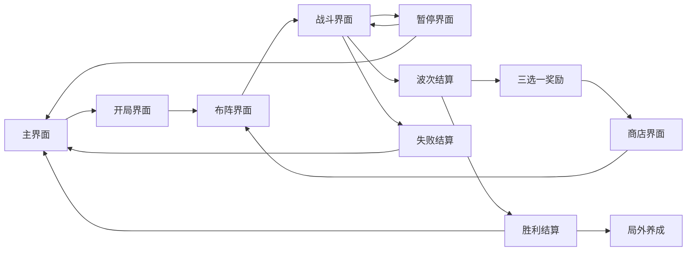

# BloomWeaver 引擎迁移总策划案

## 结论

这份文档用于把当前 Unity 工程完整迁移到新引擎。当前未指定目标引擎，因此本案只定义引擎无关的游戏规格：玩法规则、系统边界、界面职责、数据需求、输入输出、跳转和验收标准。

迁移时必须保持以下核心不变：

- 游戏定位：拓扑连线布阵 + 异步自动战斗 + Roguelite 波间成长。
- 玩家体验：战前思考布阵，战斗中观察阵图被花灵自动触发，波间通过造化和商店形成构筑。
- 核心闭环：主界面 -> 开局 -> 布阵 -> 战斗 -> 波次结算 -> 造化奖励 -> 商店 -> 下一波布阵 -> 胜利或失败。
- 核心规则：灵枢盘、灵脉划线、花灵扫描、结算三定律、五行生克、职业差异、器物蕊 Buff、造化蕊永久改动。
- 界面结构：保留当前 19 个界面和对应职责，具体 UI 技术由目标引擎决定。

## 总体体验目标

玩家扮演灵圃守阵者，通过编织灵脉让五行花灵自动释放攻击、治疗和防守能力。游戏的主要乐趣来自“预先布局、等待命中、看到连锁爆发、再根据结果调整构筑”。

体验关键词：

- 策略感：每条灵脉都有空间成本、属性选择和风险。
- 期待感：花灵扫描落点预生成，玩家能预判下一次触发。
- 爆发感：长灵脉命中后从普攻跃迁到技能或必杀。
- 压迫感：敌人持续推进，突破会伤害花灵，花灵倒下会削弱输出。
- 构筑感：奖励、商店、造化蕊和花灵等级共同塑造本局流派。

## 游戏核心

### 灵枢盘

| 项 | 规格 |
| --- | --- |
| 尺寸 | 12 列 x 6 行。 |
| 节点 | 每格为一个灵蕊节点。 |
| 节点类型 | 本源蕊、器物蕊、造化蕊。 |
| 五行 | 金、木、水、火、土。 |
| 状态 | 充盈、枯竭、复苏。 |
| 生成 | 每波或每局按配置池生成。 |

### 灵脉划线

玩家在布阵阶段拖拽连接灵蕊形成灵脉。

规则：

- 只能连接四向相邻节点。
- 已被确认灵脉占用的节点不能再次使用。
- 灵脉线段不能穿过已确认灵脉。
- 当前正在绘制的灵脉不能自交。
- 至少连接 2 个节点才可确认一条灵脉。
- 战斗阶段禁止继续划线。

### 花灵扫描

战斗阶段每名花灵按自身攻速异步行动。

规则：

- 花灵拥有五行、职业、基础攻击、攻速、攻击距离、被动经验、扫描形状。
- 有敌人进入攻击范围时才开始或继续计时。
- 每次攻击会使用预生成扫描中心和自身扫描形状覆盖棋盘格。
- 扫描命中充盈灵脉后触发攻击结算，并让命中灵脉进入枯竭态。
- 未命中灵脉时仍显示扫描反馈，但只按扫描覆盖节点参与结算。

### 结算三定律

| 定律 | 说明 |
| --- | --- |
| 同源提取 | 花灵只从同五行的本源蕊中获得有效本源节点。 |
| 阈值跃迁 | 有效节点 1-3 为普攻，4-7 为技能，8+ 为必杀。 |
| 灵脉截流 | 被命中的充盈灵脉变为枯竭，等待复苏或治疗职业复苏。 |

有效节点 = 同属性本源蕊数量 + 全部器物蕊数量 + 全部造化蕊数量。

### 五行生克

| 关系 | 倍率 |
| --- | --- |
| 攻击方克制防守方 | 1.5x |
| 攻击方被防守方克制 | 0.7x |
| 攻击方生防守方 | 1.2x |
| 攻击方被防守方生 | 0.9x |
| 同属性或无关系 | 1.0x |

克制链：金克木，木克土，土克水，水克火，火克金。
相生链：金生水，水生木，木生火，火生土，土生金。

### 花灵职业

| 职业 | 玩法定位 | 普攻 | 技能 | 必杀 |
| --- | --- | --- | --- | --- |
| 战士 | 稳定单体突破，适合短灵脉和前排击杀。 | 强 | 中 | 弱 |
| 法师 | 群体清场，适合技能和必杀构筑。 | 弱 | 强 | 强 |
| 治疗 | 回复花灵、复苏枯竭灵脉，不直接造成伤害。 | 小治疗 | 中治疗 + 复苏 1 条灵脉 | 大治疗 + 全部复苏 |

### 器物蕊

| 效果 | 设计意图 |
| --- | --- |
| DoubleDamage | 本次伤害翻倍，服务爆发构筑。 |
| Lifesteal | 按伤害治疗，服务续航构筑。 |
| Burn | 追加燃烧伤害，服务持续压制。 |
| Splash | 对额外敌人造成溅射，服务清场。 |
| Shield | 转化部分伤害为护盾，服务防守。 |

### 造化蕊

| 效果 | 设计意图 |
| --- | --- |
| PermanentAtkUp | 全局攻击永久提升。 |
| ReviveSpeedUp | 灵脉复苏更快，提高长线容错。 |
| AttackSpeedUp | 攻速更快，提高扫描频率。 |
| WaveTimerExtend | 延长战斗波次时间，提供更多击杀窗口。 |
| ShieldOnWaveStart | 每波开始自动获得护盾。 |

## 当前内容基线

| 内容 | 当前基线 |
| --- | --- |
| 默认花灵 | 5 名，金木水火土各 1 名。 |
| 默认队伍 | 金战士、木治疗、水法师、火战士、土法师。 |
| 最小循环 | 3 波，分别为试探潮、压阵潮、终局潮。 |
| 奖励池 | 8 个波间造化奖励。 |
| 商店池 | 6 个商品，每次显示 6 个，单次商店最多购买 2 个。 |
| 初始资源 | 灵砂 20，识海 0。 |
| 失败条件 | 全部上阵花灵倒下。 |
| 最终胜利 | 当前最小循环目标为守过 3 波。 |

## 引擎迁移系统边界

| 系统 | 迁移后职责 | 不应承担 |
| --- | --- | --- |
| 流程系统 | 管理主阶段、波次、暂停、胜负和重开。 | 不直接写 UI 布局。 |
| 棋盘系统 | 生成和查询灵枢盘、节点状态。 | 不处理按钮和页面导航。 |
| 连线系统 | 处理输入、连线合法性、占用和撤销。 | 不计算伤害。 |
| 扫描系统 | 根据花灵扫描形状和中心点产生命中格。 | 不选择奖励。 |
| 战斗结算 | 按三定律产出攻击结果。 | 不播放 UI 动画。 |
| 敌人系统 | 刷怪、推进、受击、死亡、突破、掉落。 | 不直接改变奖励池。 |
| 成长系统 | 管理奖励、商店、运行时属性、花灵等级。 | 不直接绘制战斗场景。 |
| UI 导航 | 打开、关闭、覆盖、返回来源界面。 | 不写玩法结算规则。 |
| 存档设置 | 保存设置、图鉴、局外成长和必要进度。 | 不处理战斗帧逻辑。 |

## 主流程

## 界面策划入口

| 序号 | 界面 | 详细策划案 | 迁移优先级 |
| --- | --- | --- | --- |
| 1 | 主界面 | [main-menu.md](screens/main-menu.md) | P0 |
| 2 | 开局界面 | [opening.md](screens/opening.md) | P0 |
| 3 | 布阵界面 | [planning.md](screens/planning.md) | P0 |
| 4 | 战斗界面 | [combat.md](screens/combat.md) | P0 |
| 5 | 暂停界面 | [pause.md](screens/pause.md) | P1 |
| 6 | 三选一奖励界面 | [reward.md](screens/reward.md) | P0 |
| 7 | 商店界面 | [shop.md](screens/shop.md) | P0 |
| 8 | 波次结算界面 | [result-wave.md](screens/result-wave.md) | P0 |
| 9 | 失败结算界面 | [result-failure.md](screens/result-failure.md) | P0 |
| 10 | 胜利结算界面 | [victory.md](screens/victory.md) | P1 |
| 11 | 阵图总览界面 | [overview.md](screens/overview.md) | P1 |
| 12 | 上阵替换界面 | [replacement.md](screens/replacement.md) | P1 |
| 13 | 设置界面 | [settings.md](screens/settings.md) | P2 |
| 14 | 花灵图鉴界面 | [codex.md](screens/codex.md) | P2 |
| 15 | 敌人图鉴界面 | [enemy-codex.md](screens/enemy-codex.md) | P2 |
| 16 | 局外养成界面 | [garden.md](screens/garden.md) | P3 |
| 17 | 确认弹窗 | [confirm.md](screens/confirm.md) | P1 |
| 18 | 通用提示框 | [tip.md](screens/tip.md) | P1 |
| 19 | 独立主界面模块 | [standalone-main-menu.md](screens/standalone-main-menu.md) | P3 |

## 迁移里程碑

### M1 核心可玩闭环

目标：在新引擎中跑通从开局到失败或波次胜利的最小闭环。

范围：

- 主界面、开局、布阵、战斗、波次结算、失败结算。
- 12x6 棋盘、连线合法性、扫描、三定律、敌人推进、花灵 HP。
- 固定 3 波配置，固定 5 名花灵，固定奖励池。

验收：

- 玩家能开始一局、完成布阵、进入战斗、看到花灵自动攻击。
- 敌人能突破并伤害花灵。
- 全部花灵倒下会失败。
- 守过波次会进入结算。

### M2 成长闭环

目标：补齐奖励和商店，让单局构筑成立。

范围：

- 三选一奖励、商店、运行时属性、金币经验、花灵升级。
- 奖励影响攻击、攻速、生命、复苏、技能和必杀。

验收：

- 每波结束能选择奖励。
- 商店能购买商品并扣除资源。
- 加成能影响后续战斗。

### M3 完整 UI 和可用性

目标：补齐暂停、总览、替换、确认、提示和完整 UI 导航。

范围：

- 暂停、阵图总览、上阵替换、确认弹窗、提示框。
- 页面返回来源、无效输入提示、输入锁。

验收：

- 任意覆盖层关闭后回到正确来源界面。
- 快速连点关键按钮不会重复执行业务。

### M4 内容扩展和发布准备

目标：补齐图鉴、设置、局外养成、音效和视觉 polish。

范围：

- 设置、花灵图鉴、敌人图鉴、局外养成、胜利结算、音效、粒子。
- 存档、设置持久化、正式资源替换。

验收：

- 设置可保存。
- 图鉴和局外养成可打开且状态正确。
- 胜利后能进入局外养成或再来一局。

## 全局验收标准

- 所有主页面同一时间只有一个可交互。
- 所有覆盖层打开后下层不可误触。
- 所有高风险操作要有确认弹窗或明确禁用规则。
- 所有动态文本都有数据来源，不能烘焙在背景图里。
- 所有列表有空状态。
- 所有按钮有默认、选中、按下、禁用状态或统一反馈方案。
- 战斗主体和 UI HUD 分层清晰。
- 玩法规则不能写在界面控制器里。
- 目标引擎实现完成后，需要按逐界面策划案中的“迁移验收”逐项验证。

## 待目标引擎确认后补充

- 场景、节点、Prefab 或 Actor 的对应组织方式。
- UI 技术路线和分辨率适配规则。
- Sprite2D、粒子、动画、音频的导入规则。
- 事件系统或消息总线实现方式。
- 存档路径和平台接口。
- 自动化测试方案。
