# UI 界面效果图索引

## 结论

- 本页把当前项目已有的界面效果图和界面规格绑定起来。
- 普通 UGUI 界面与战斗界面统一使用 `images/ui-reference-20260517/<界面名>.png` 作为主效果图。
- 独立主界面正式施工只能使用 `Assets/StandaloneMainMenu/Sprites/Final` 下的三张正式 PNG；`ReferenceOnly` 合成图只允许作为文档视觉参考，不允许接入 Prefab、Scene、Config 或 RuntimeConfig。
- 后续 AI 开发界面时，应同时读取本页、`ui-interface-detail-spec.md`、`ui-control-binding-spec.md`、`ui-navigation-contract.md`、`ui-asset-production-manifest.md`。

## 使用规则

| 项 | 规则 |
| --- | --- |
| 效果图用途 | 用于理解布局、视觉风格、元素密度、色彩和构图。 |
| 施工素材用途 | 以 `ui-asset-production-manifest.md` 中的正式素材清单为准。 |
| 不允许 | 不得把未确认的参考变体直接写入 Prefab、Scene、Config、RuntimeConfig。 |
| AI 开发读取顺序 | 先读本页效果图，再读界面详细说明，再读控件绑定和素材清单。 |

## 效果图总表

| 界面 | 主效果图 | 尺寸 | 技术 |
| --- | --- | --- | --- |
| 主界面 | `images/ui-reference-20260517/main-menu.png` | 1672x941 | UGUI |
| 开局界面 | `images/ui-reference-20260517/opening.png` | 1672x941 | UGUI |
| 布阵界面 | `images/ui-reference-20260517/planning.png` | 1672x941 | UGUI |
| 战斗界面 | `images/ui-reference-20260517/combat.png` | 1672x941 | Sprite2D 主体 + UGUI HUD |
| 暂停界面 | `images/ui-reference-20260517/pause.png` | 1672x941 | UGUI 覆盖层 |
| 三选一奖励 | `images/ui-reference-20260517/reward.png` | 1672x941 | UGUI |
| 商店界面 | `images/ui-reference-20260517/shop.png` | 1672x941 | UGUI |
| 波次结算 | `images/ui-reference-20260517/result-wave.png` | 1672x941 | UGUI |
| 失败结算 | `images/ui-reference-20260517/result-failure.png` | 1672x941 | UGUI |
| 胜利结算 | `images/ui-reference-20260517/victory.png` | 1672x941 | UGUI |
| 阵图总览 | `images/ui-reference-20260517/overview.png` | 1672x941 | UGUI 覆盖层 |
| 上阵替换 | `images/ui-reference-20260517/replacement.png` | 1672x941 | UGUI 覆盖层 |
| 设置界面 | `images/ui-reference-20260517/settings.png` | 1672x941 | UGUI 覆盖层 |
| 花灵图鉴 | `images/ui-reference-20260517/codex.png` | 1672x941 | UGUI |
| 敌人图鉴 | `images/ui-reference-20260517/enemy-codex.png` | 1672x941 | UGUI |
| 局外养成 | `images/ui-reference-20260517/garden.png` | 1672x941 | UGUI |
| 确认弹窗 | `images/ui-reference-20260517/confirm.png` | 1448x1086 | UGUI 弹窗 |
| 通用提示框 | `images/ui-reference-20260517/tip.png` | 1672x941 | UGUI 弹窗 |
| 独立主界面 | `images/ui-reference-20260517/standalone-main-menu.png` | 1672x941 | UGUI，文档参考图 |

## 1. 主界面

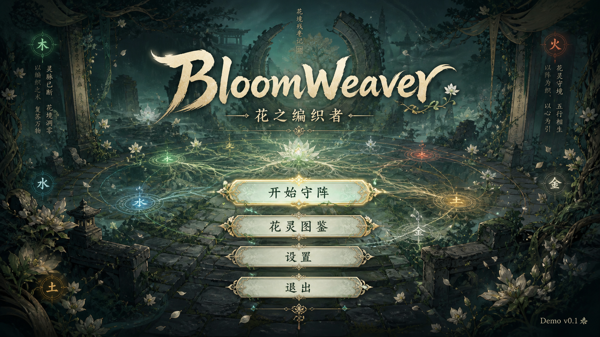

| 项 | 内容 |
| --- | --- |
| 效果图路径 | `images/ui-reference-20260517/main-menu.png` |
| 开发规格 | `ui-interface-detail-spec.md` 的“主界面”。 |
| 施工重点 | 全屏背景、Logo、四个主按钮、左右五行装饰、版本号。 |

## 2. 开局界面

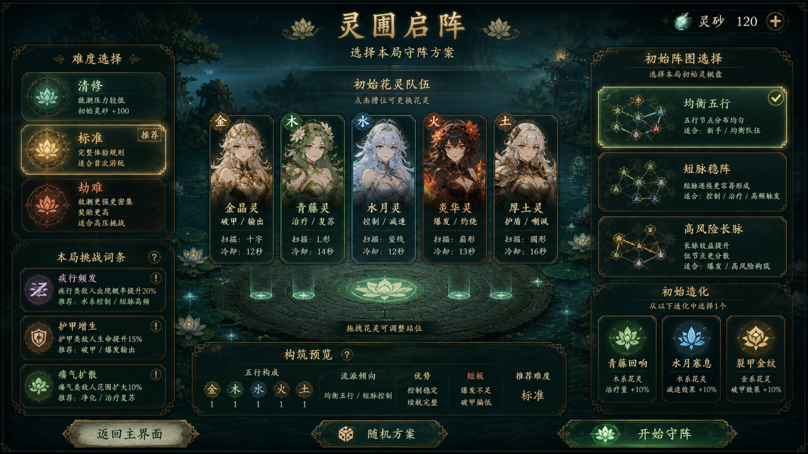

| 项 | 内容 |
| --- | --- |
| 效果图路径 | `images/ui-reference-20260517/opening.png` |
| 开发规格 | `ui-interface-detail-spec.md` 的“开局界面”。 |
| 施工重点 | 难度、挑战词条、五个花灵卡位、构筑预览、初始阵图、初始造化。 |

## 3. 布阵界面

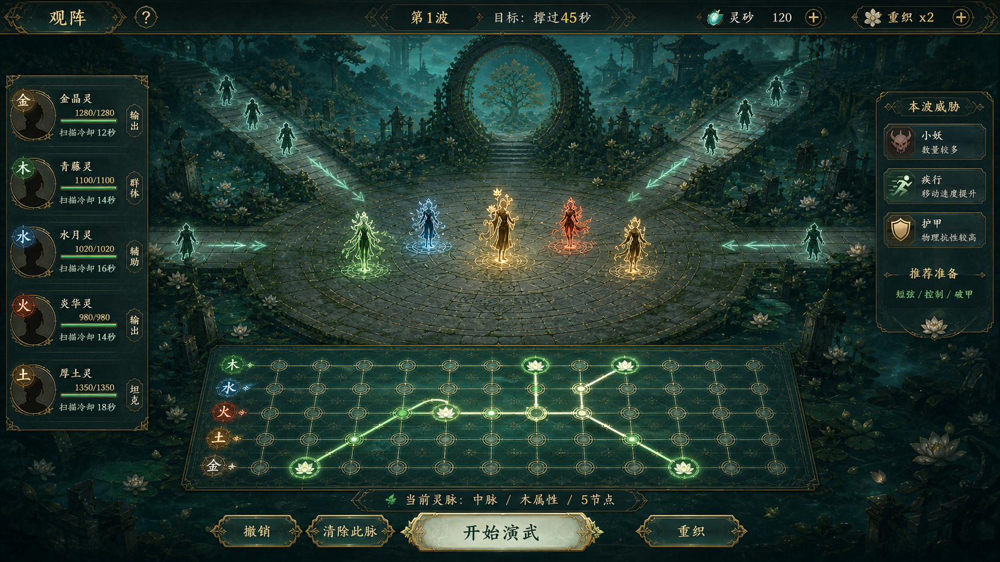

| 项 | 内容 |
| --- | --- |
| 效果图路径 | `images/ui-reference-20260517/planning.png` |
| 开发规格 | `ui-interface-detail-spec.md` 的“布阵界面”。 |
| 施工重点 | 顶部 HUD、左侧花灵状态、中央棋盘、灵脉连线、右侧威胁、底部操作。 |

## 4. 战斗界面

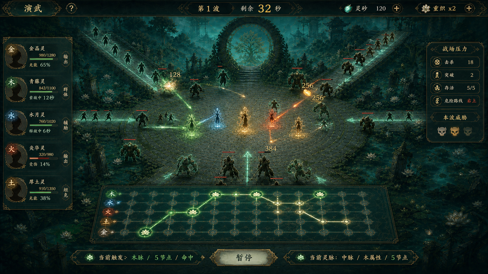

| 项 | 内容 |
| --- | --- |
| 效果图路径 | `images/ui-reference-20260517/combat.png` |
| 开发规格 | `battle-sprite2d-presentation-spec.md`。 |
| 施工重点 | Sprite2D 战场、敌人、花灵、投射物、伤害数字、UGUI 战斗 HUD。 |

## 5. 暂停界面

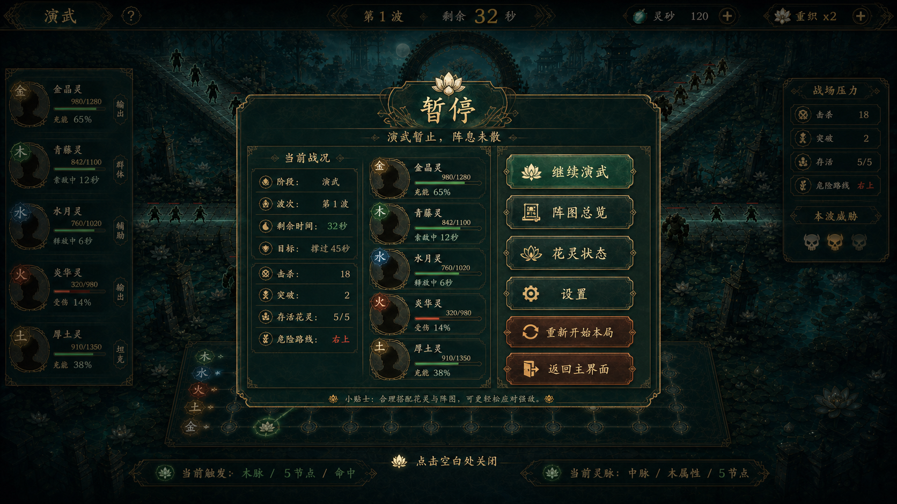

| 项 | 内容 |
| --- | --- |
| 效果图路径 | `images/ui-reference-20260517/pause.png` |
| 开发规格 | `ui-interface-detail-spec.md` 的“暂停界面”。 |
| 施工重点 | 暗色遮罩、暂停主面板、战况摘要、右侧菜单按钮。 |

## 6. 三选一奖励界面

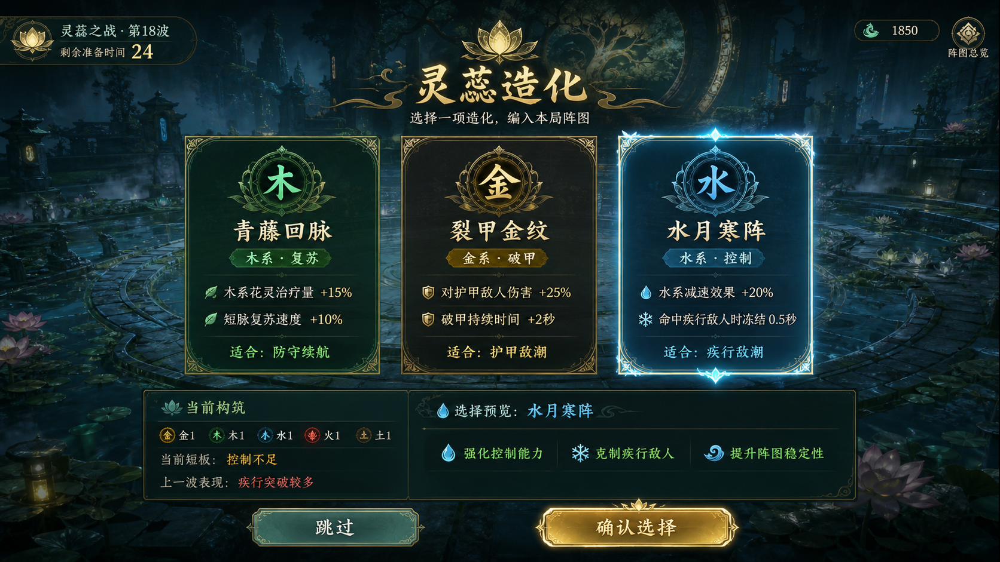

| 项 | 内容 |
| --- | --- |
| 效果图路径 | `images/ui-reference-20260517/reward.png` |
| 开发规格 | `ui-interface-detail-spec.md` 的“三选一奖励界面”。 |
| 施工重点 | 三张奖励卡、选中态、资源、构筑预览、确认/跳过按钮。 |

## 7. 商店界面

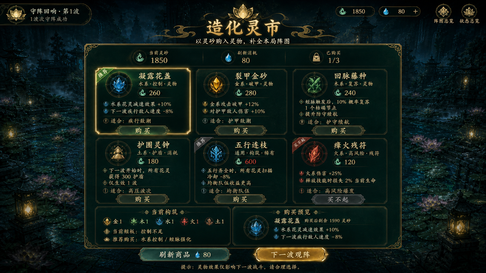

| 项 | 内容 |
| --- | --- |
| 效果图路径 | `images/ui-reference-20260517/shop.png` |
| 开发规格 | `ui-interface-detail-spec.md` 的“商店界面”。 |
| 施工重点 | 商品六宫格、价格、购买按钮、推荐购买、刷新和下一波。 |

## 8. 波次结算界面

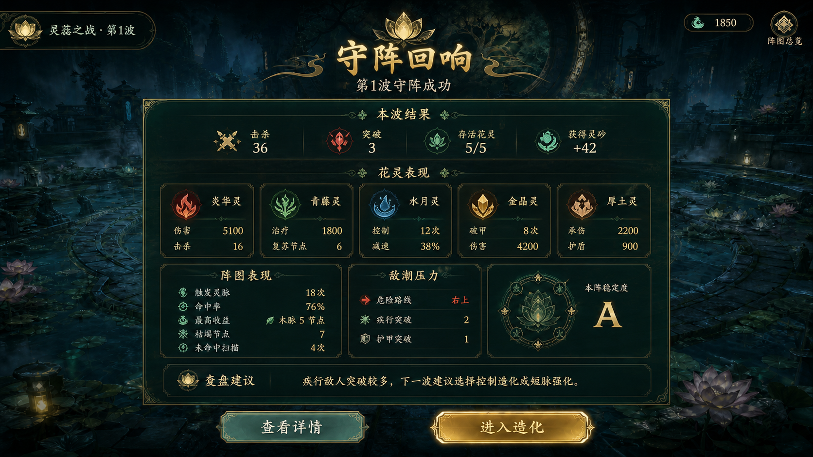

| 项 | 内容 |
| --- | --- |
| 效果图路径 | `images/ui-reference-20260517/result-wave.png` |
| 开发规格 | `ui-interface-detail-spec.md` 的“波次结算界面”。 |
| 施工重点 | 击杀、突破、存活、获得资源、评级、花灵表现、进入造化。 |

## 9. 失败结算界面

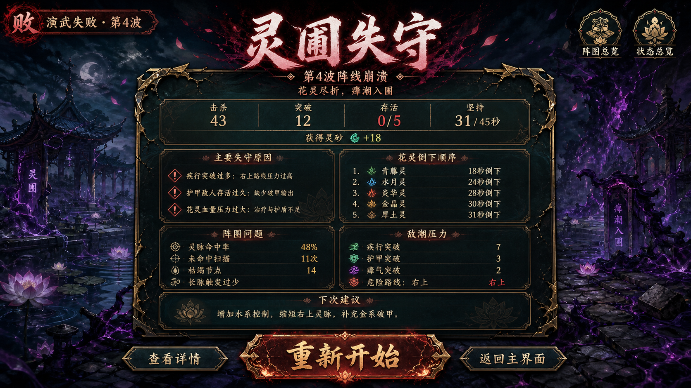

| 项 | 内容 |
| --- | --- |
| 效果图路径 | `images/ui-reference-20260517/result-failure.png` |
| 开发规格 | `ui-interface-detail-spec.md` 的“失败结算界面”。 |
| 施工重点 | 失败标题、失败统计、失败原因、重新开始、返回主界面。 |

## 10. 胜利结算界面

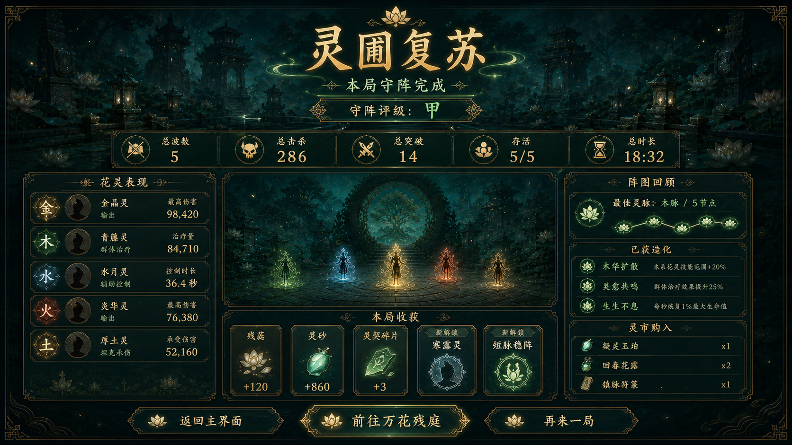

| 项 | 内容 |
| --- | --- |
| 效果图路径 | `images/ui-reference-20260517/victory.png` |
| 开发规格 | `ui-interface-detail-spec.md` 的“胜利结算界面”。 |
| 施工重点 | 总评级、总波数、总击杀、本局收获、局外养成、再来一局。 |

## 11. 阵图总览界面

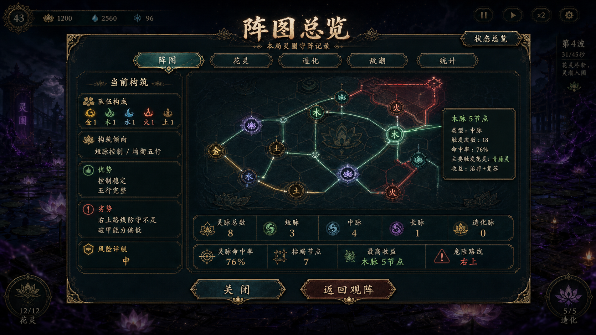

| 项 | 内容 |
| --- | --- |
| 效果图路径 | `images/ui-reference-20260517/overview.png` |
| 开发规格 | `ui-interface-detail-spec.md` 的“阵图总览界面”。 |
| 施工重点 | 标签页、中央阵图、构筑摘要、风险评级、状态总览。 |

## 12. 上阵替换界面

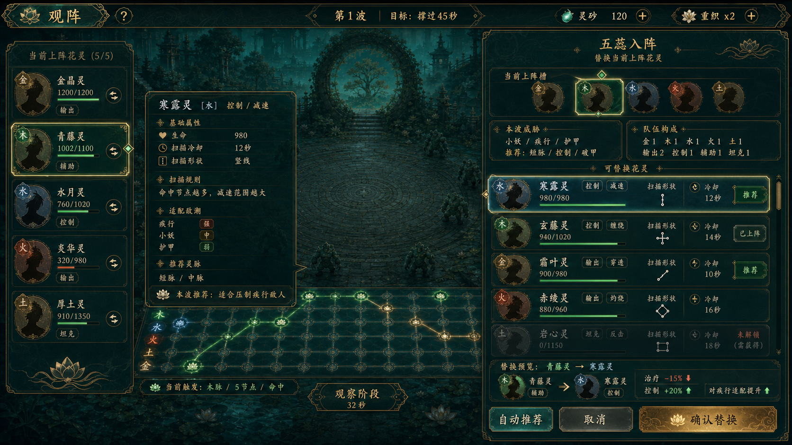

| 项 | 内容 |
| --- | --- |
| 效果图路径 | `images/ui-reference-20260517/replacement.png` |
| 开发规格 | `ui-interface-detail-spec.md` 的“上阵替换界面”。 |
| 施工重点 | 当前上阵槽、候选花灵列表、详情、替换预览、自动推荐。 |

## 13. 设置界面

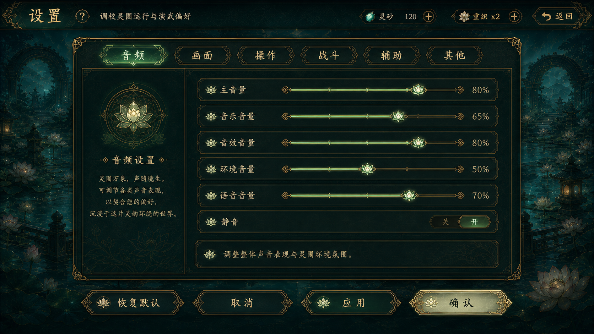

| 项 | 内容 |
| --- | --- |
| 效果图路径 | `images/ui-reference-20260517/settings.png` |
| 开发规格 | `ui-interface-detail-spec.md` 的“设置界面”。 |
| 施工重点 | 左侧分类、右侧滑条、开关、恢复默认、应用、确认。 |

## 14. 花灵图鉴界面

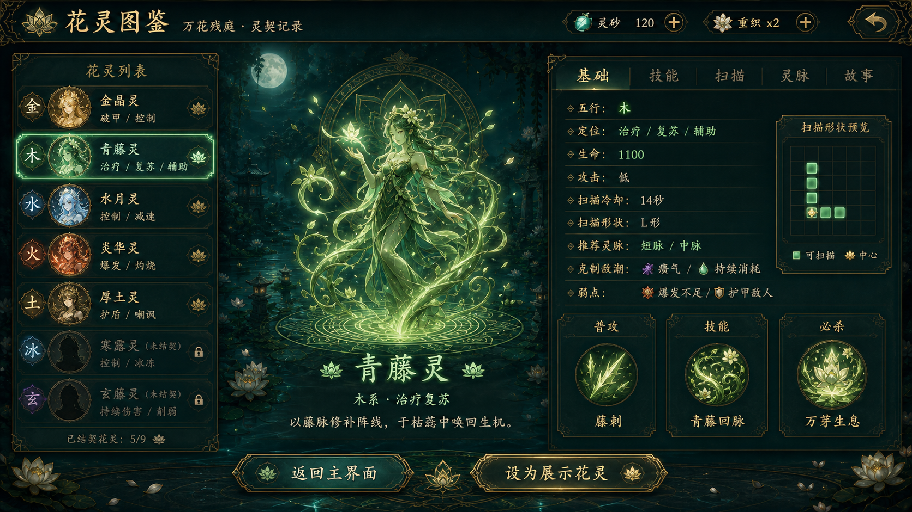

| 项 | 内容 |
| --- | --- |
| 效果图路径 | `images/ui-reference-20260517/codex.png` |
| 开发规格 | `ui-interface-detail-spec.md` 的“花灵图鉴界面”。 |
| 施工重点 | 花灵列表、立绘、详情标签、技能、扫描、灵脉、故事。 |

## 15. 敌人图鉴界面

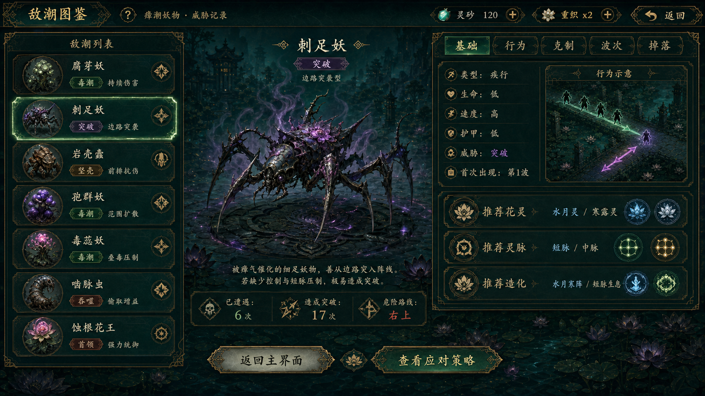

| 项 | 内容 |
| --- | --- |
| 效果图路径 | `images/ui-reference-20260517/enemy-codex.png` |
| 开发规格 | `ui-interface-detail-spec.md` 的“敌人图鉴界面”。 |
| 施工重点 | 敌人列表、立绘、行为、克制、波次、掉落、应对策略。 |

## 16. 局外养成界面

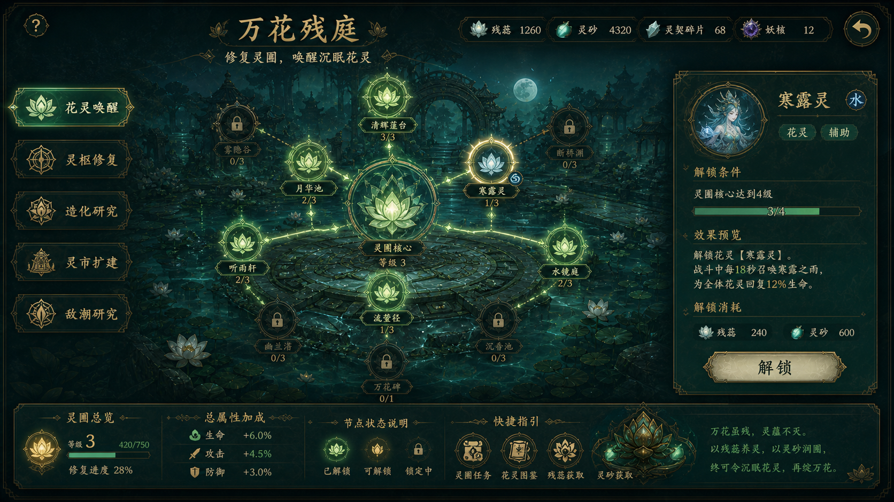

| 项 | 内容 |
| --- | --- |
| 效果图路径 | `images/ui-reference-20260517/garden.png` |
| 开发规格 | `ui-interface-detail-spec.md` 的“局外养成界面”。 |
| 施工重点 | 分类菜单、节点树、资源栏、节点详情、解锁按钮。 |

## 17. 确认弹窗

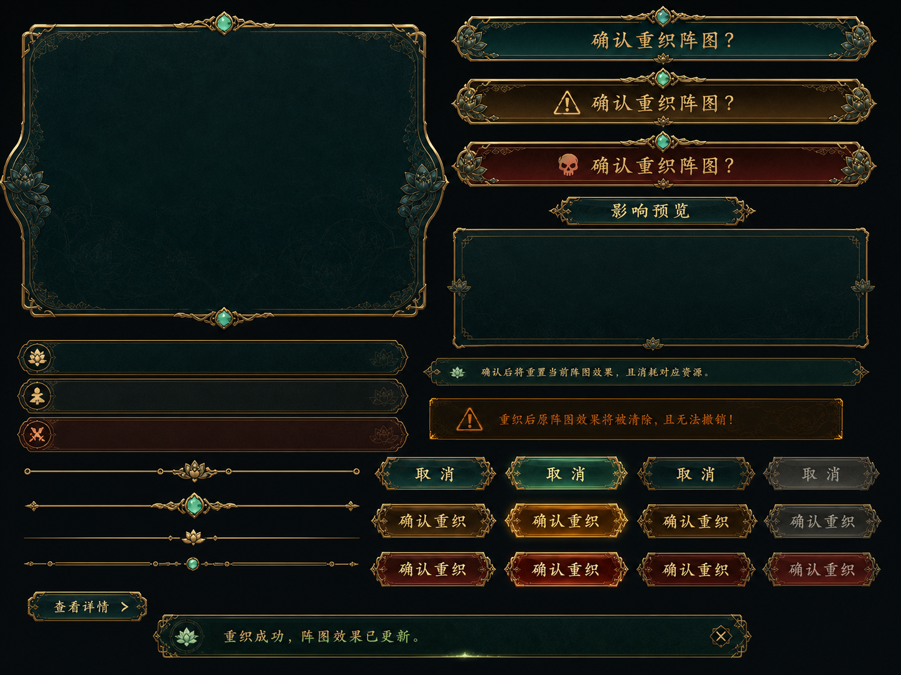

| 项 | 内容 |
| --- | --- |
| 效果图路径 | `images/ui-reference-20260517/confirm.png` |
| 开发规格 | `ui-interface-detail-spec.md` 的“确认弹窗”。 |
| 施工重点 | 模态遮罩、标题、消息、影响预览、取消、确认。 |

## 18. 通用提示框

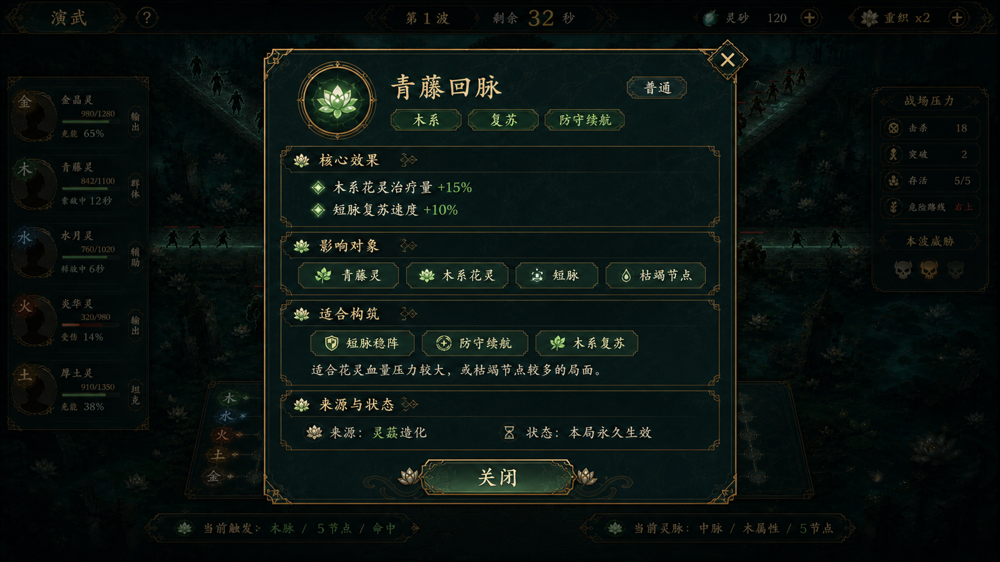

| 项 | 内容 |
| --- | --- |
| 效果图路径 | `images/ui-reference-20260517/tip.png` |
| 开发规格 | `ui-interface-detail-spec.md` 的“通用提示框”。 |
| 施工重点 | 成功/警告/错误提示、关闭按钮、Toast 或模态提示规则。 |

## 19. 独立主界面

| 项 | 内容 |
| --- | --- |
| 文档参考图 | `images/ui-reference-20260517/standalone-main-menu.png` |
| 正式施工资源 | `Assets/StandaloneMainMenu/Sprites/Final/background_main_scene.png`; `logo_title_full.png`; `button_plate_main.png` |
| 开发规格 | `ui-interface-detail-spec.md` 的“独立主界面模块”。 |
| 施工重点 | 参考图只看效果；正式施工只使用 Final 目录三张 PNG 和 TMP 文本。 |

## 后续维护规则

- 如果新增或替换效果图，必须更新本页总表和对应界面小节。
- 如果效果图变更导致布局、控件或素材需求变化，必须同步更新 `ui-interface-detail-spec.md`、`ui-control-binding-spec.md` 和 `ui-asset-production-manifest.md`。
- 如果某张效果图只是美术探索稿，必须标注“参考变体”，不能写成正式施工依据。
