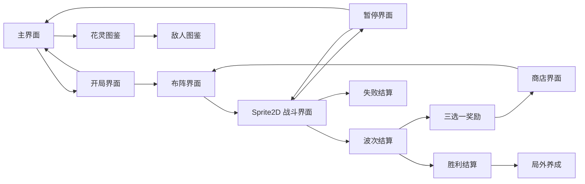

# UGUI 界面与 Sprite2D 战斗界面详细说明

## 结论

- 除战斗主体外，项目界面目标技术路线为 UGUI。
- 战斗界面主体使用 Sprite2D 开发，战斗 HUD 使用 UGUI 叠加。
- 当前 `Assets/Configs/UI/BloomWeaverUGUIRuntimeConfig.asset` 已登记主要界面 Prefab 和参考图路径。
- 当前每个界面素材目录中 `01.png` 作为主参考图；同目录 `ChatGPT Image ...` 文件作为参考变体，除非另行确认，不直接作为最终施工依赖。
- 按钮具体动效尚未在文档资料中形成统一配置。本页将其写为“目标统一反馈”，实现时应放入统一 UI 配置或按钮组件，不应散落硬编码。

## 效果图入口

每个界面的效果图已统一汇总到 `ui-effect-image-gallery.md`。后续 AI 开发界面时，应先读取效果图索引，再读取本页的界面功能、布局和交互说明。

## 全局 UI 规范

### 技术分层

| 层级 | 技术 | 内容 |
| --- | --- | --- |
| 普通界面层 | UGUI | 主界面、开局、布阵、奖励、商店、结算、暂停、设置、图鉴、弹窗。 |
| 战斗表现层 | Sprite2D | 战场、敌人、花灵、投射物、攻击轨迹、受击特效、伤害表现。 |
| 战斗 HUD 层 | UGUI | 波次、计时、资源、暂停、当前灵脉、战况提示。 |

### 统一按钮反馈

| 状态 | 目标反馈 |
| --- | --- |
| 默认 | 使用金边深绿或羊皮色底板，文字为浅金或深墨绿，保持清晰可读。 |
| 悬停/手柄聚焦 | 边框加亮，底板亮度略升，文字亮度略升；不改变布局尺寸。 |
| 按下 | 底板轻微压暗，按钮整体缩放到约 98%，播放点击音效。 |
| 选中 | 增加金色外发光、勾选标记或顶部选中条，同时刷新右侧预览/详情。 |
| 不可用 | 降低透明度，取消点击响应，提示文字说明不足条件。 |

### 通用素材口径

| 类型 | 路径/来源 | 说明 |
| --- | --- | --- |
| 界面参考图 | `images/ui-reference-20260517/<界面名>.png` | 当前每个界面的主视觉参考，尺寸多数为 1672x941。 |
| UGUI Prefab | `Assets/Prefabs/UI/Screens/*.prefab` | 普通界面施工入口。 |
| 战斗 Sprite2D Prefab | `Assets/Prefabs/UI/Battle2D/combat-screen.prefab` | 战斗主体分层入口。 |
| UGUI 配置 | `Assets/Configs/UI/BloomWeaverUGUIRuntimeConfig.asset` | 界面 key、显示名、参考图、Prefab 绑定。 |
| TMP 字体 | `Assets/TextMesh Pro/Resources` | 界面文字优先使用 TMP。 |
| 独立主界面正式素材 | `Assets/StandaloneMainMenu/Sprites/Final` | 独立主菜单只能使用该目录三张正式 PNG。 |

## 界面流程

## 1. 主界面

| 项 | 内容 |
| --- | --- |
| screen key | `main-menu-screen` |
| 目标技术 | UGUI |
| Prefab | `Assets/Prefabs/UI/Screens/main-menu-screen.prefab` |
| 参考素材 | `images/ui-reference-20260517/main-menu.png`，1672x941 |
| 素材外观 | 幽暗森林与花境入口，中央远景有发光阵点，顶部为大标题 `BloomWeaver`，整体为墨绿、金色、浅白按钮的东方幻想风格。 |

布局：

- 全屏背景图铺满画面。
- 顶部偏中放置游戏 Logo 与副标题“花之编织者”。
- 中央纵向排列四个主按钮：开始守阵、花灵图鉴、设置、退出。
- 左右边缘放置五行装饰字和竖排装饰文案。
- 右下角显示 Demo 版本号。

玩家可见元素：

- 游戏标题、五行装饰、主菜单按钮、版本号。

按钮与反馈：

| 按钮 | 点击反应 | 跳转 |
| --- | --- | --- |
| 开始守阵 | 按钮压暗/缩放，播放点击音，淡出主界面。 | 进入开局界面。 |
| 花灵图鉴 | 打开覆盖层，主界面背景保留或被图鉴背景覆盖。 | 打开花灵图鉴。 |
| 设置 | 打开设置面板。 | 打开设置界面。 |
| 退出 | 按钮反馈后执行退出；编辑器下应只记录或停止播放，构建包中退出应用。 | 退出游戏。 |

## 2. 开局界面

| 项 | 内容 |
| --- | --- |
| screen key | `opening-screen` |
| 目标技术 | UGUI |
| Prefab | `Assets/Prefabs/UI/Screens/opening-screen.prefab` |
| 参考素材 | `images/ui-reference-20260517/opening.png`，1672x941 |
| 素材外观 | 夜色庭院与灵阵平台，中央是五名花灵卡位，四周是金边墨绿信息面板。 |

布局：

- 顶部中间显示标题“灵圃启阵”和副标题“选择本局守阵方案”。
- 右上角显示灵砂资源，带一个小加号入口。
- 左侧纵向面板显示难度选择：清修、标准、劫难。
- 左侧下方显示挑战词条：疾行频发、护甲增生、瘴气扩散。
- 中央横向排列 5 张初始花灵卡。
- 右侧上方显示构筑预览：金、木、水、火、土及构筑评价。
- 右侧中部显示初始阵图选择。
- 右侧下部显示初始造化卡。
- 底部放置返回主界面、随机方案、开始守阵。

玩家可见元素：

- 难度、词条、灵砂、初始队伍、阵图方案、初始造化、构筑预览。

按钮与反馈：

| 操作 | 点击反应 | 跳转/结果 |
| --- | --- | --- |
| 点击花灵卡位 | 卡位高亮，打开替换界面。 | 打开上阵替换界面。 |
| 难度按钮 | 选中项高亮，刷新风险/收益预览。 | 留在当前界面。 |
| 挑战词条 | 词条切换选中态，刷新构筑压力提示。 | 留在当前界面。 |
| 初始阵图卡 | 卡片高亮，构筑预览同步更新。 | 留在当前界面。 |
| 初始造化卡 | 卡片高亮，预览初始加成。 | 留在当前界面。 |
| 返回主界面 | 按钮反馈后关闭开局配置。 | 回主界面。 |
| 随机方案 | 队伍、阵图、造化出现刷新反馈。 | 留在当前界面。 |
| 开始守阵 | 若条件满足，按钮变亮并进入淡出；若阵容不满足，按钮不可用或弹提示。 | 进入布阵界面。 |

## 3. 布阵界面

| 项 | 内容 |
| --- | --- |
| screen key | `planning-screen` |
| 目标技术 | UGUI |
| Prefab | `Assets/Prefabs/UI/Screens/planning-screen.prefab` |
| 参考素材 | `images/ui-reference-20260517/planning.png`，1672x941 |
| 素材外观 | 森林战场远景，中央为灵阵棋盘和连线路径，左侧花灵列表，右侧本波威胁，顶部资源栏。 |

布局：

- 顶部栏显示阶段、帮助、波次、目标、计时、灵砂和重织次数。
- 左侧竖向花灵状态栏，显示五行花灵头像/属性/状态。
- 中央上方是战场预览远景。
- 中央下方是布阵棋盘，棋盘节点按网格排列。
- 棋盘上显示当前灵脉连线、节点高亮、五行节点标记。
- 右侧显示本波威胁、敌人类型、推荐准备。
- 底部为操作条：撤销、清除此脉、开始演武、重织。

玩家可见元素：

- 当前波次、目标、资源、花灵状态、敌人威胁、棋盘、灵脉线路、底部操作。

按钮与反馈：

| 操作 | 点击反应 | 跳转/结果 |
| --- | --- | --- |
| 点击棋盘节点 | 节点发光，若可连接则绘制灵脉线；不可连接时给轻微拒绝反馈。 | 留在当前界面。 |
| 撤销 | 最近一段灵脉线回退，节点高亮撤销。 | 留在当前界面。 |
| 清除此脉 | 当前灵脉线淡出并清空。 | 留在当前界面。 |
| 重织 | 打开确认弹窗或直接消耗重织次数；成功后棋盘重组。 | 可能打开确认弹窗。 |
| 开始演武 | 按钮高亮，布阵 HUD 淡出，进入战斗。 | 进入战斗界面。 |
| 阵图总览入口 | 打开总览覆盖层。 | 打开阵图总览。 |

## 4. 战斗界面

| 项 | 内容 |
| --- | --- |
| screen key | `combat-screen` |
| 目标技术 | 战斗主体 Sprite2D，战斗 HUD UGUI |
| Prefab | `Assets/Prefabs/UI/Battle2D/combat-screen.prefab` |
| 参考素材 | `images/ui-reference-20260517/combat.png`，1672x941 |
| 素材外观 | 与布阵同一森林战场，但敌人、花灵、攻击光束和伤害数字更明显，底部仍保留灵阵棋盘。 |

Sprite2D 分层：

| 层 | 内容 |
| --- | --- |
| `reference-layer` | 参考背景或背景校准层。 |
| `battle-field-layer` | 战斗场地、路径、地面装饰。 |
| `ally-sprites` | 花灵、友方召唤物、守阵单位。 |
| `enemy-sprites` | 妖物、精英、推进单位。 |
| `effect-sprites` | 投射物、攻击线、命中特效、元素爆发。 |
| `foreground-sprites` | 前景遮挡、光效、氛围层。 |

UGUI HUD 布局：

- 顶部显示波次、目标、计时、资源。
- 左侧保留花灵状态小栏。
- 右侧显示战场压力、击杀、突破、存活等。
- 底部显示当前触发、当前灵脉和暂停按钮。

玩家可见元素：

- 敌人沿路径推进，花灵释放攻击，伤害数字弹出，灵脉触发特效，HUD 显示战况。

按钮与反馈：

| 操作 | 点击反应 | 跳转/结果 |
| --- | --- | --- |
| 暂停 | HUD 暗下，战斗时间暂停，弹出暂停面板。 | 打开暂停界面。 |
| 战斗结束 | 屏幕出现收束反馈，停止刷怪和攻击。 | 胜利进入波次结算，失败进入失败结算。 |

## 5. 暂停界面

| 项 | 内容 |
| --- | --- |
| screen key | `pause-screen` |
| 目标技术 | UGUI 覆盖层 |
| Prefab | `Assets/Prefabs/UI/Screens/pause-screen.prefab` |
| 参考素材 | `images/ui-reference-20260517/pause.png`，1672x941 |
| 素材外观 | 在战斗画面上覆盖暗色遮罩，中央是金边暂停面板，按钮呈右侧竖排。 |

布局：

- 背景保留战斗画面并加暗色遮罩。
- 中央面板显示“暂停 / 演武暂停”。
- 左中显示当前战况：波次、剩余、击杀、突破、存活花灵。
- 中部显示花灵状态摘要。
- 右侧纵向按钮：继续演武、阵图总览、花灵状态、设置、重新开始本局、返回主界面。

按钮与反馈：

| 按钮 | 点击反应 | 跳转/结果 |
| --- | --- | --- |
| 继续演武 | 面板淡出，恢复战斗时间。 | 回战斗界面。 |
| 阵图总览 | 当前暂停层保持或降级遮罩，打开总览。 | 打开阵图总览。 |
| 花灵状态 | 打开花灵信息入口。 | 打开花灵图鉴或状态页。 |
| 设置 | 打开设置面板。 | 打开设置界面。 |
| 重新开始本局 | 可接确认弹窗；确认后重置当前局。 | 回开局或布阵入口，按流程配置。 |
| 返回主界面 | 可接确认弹窗；确认后退出本局。 | 回主界面。 |

## 6. 三选一奖励界面

| 项 | 内容 |
| --- | --- |
| screen key | `reward-screen` |
| 目标技术 | UGUI |
| Prefab | `Assets/Prefabs/UI/Screens/reward-screen.prefab` |
| 参考素材 | `images/ui-reference-20260517/reward.png`，1672x941 |
| 素材外观 | 夜色战后场景，中央三张大卡片，卡面以木、金、水等元素色区分，底部为构筑影响预览。 |

布局：

- 顶部显示“灵蕊造化”或当前波次奖励标题。
- 右上显示资源。
- 中央横向三张奖励卡。
- 每张卡显示类型、名称、两条效果、适合构筑。
- 底部显示当前构筑、上一波表现、选择预览。
- 底部按钮：跳过、确认选择、阵图总览。

按钮与反馈：

| 操作 | 点击反应 | 跳转/结果 |
| --- | --- | --- |
| 点击奖励卡 | 卡片放大或金边高亮，底部预览刷新。 | 留在当前界面。 |
| 确认选择 | 选中奖励飞入构筑栏，播放获得反馈。 | 进入商店界面或下一阶段。 |
| 跳过 | 弹出轻提示或直接跳过。 | 进入商店界面或下一阶段。 |
| 阵图总览 | 打开总览覆盖层。 | 打开阵图总览。 |

## 7. 商店界面

| 项 | 内容 |
| --- | --- |
| screen key | `shop-screen` |
| 目标技术 | UGUI |
| Prefab | `Assets/Prefabs/UI/Screens/shop-screen.prefab` |
| 参考素材 | `images/ui-reference-20260517/shop.png`，1672x941 |
| 素材外观 | 森林灵市背景，中央为六宫格商品卡，卡片是金边深绿底，顶部资源栏和右上功能按钮。 |

布局：

- 顶部显示“造化灵市”、当前波次、灵砂/灵露等资源。
- 中央 2x3 商品卡网格。
- 每张商品卡显示名称、类型、价格、两条效果、适合对象、购买按钮。
- 右侧显示构筑摘要、推荐购买、购买预览。
- 底部按钮：刷新商品、下一波观阵。
- 顶部或侧边按钮：阵图总览、状态总览。

按钮与反馈：

| 操作 | 点击反应 | 跳转/结果 |
| --- | --- | --- |
| 点击商品卡 | 商品卡高亮，右侧预览刷新。 | 留在当前界面。 |
| 购买 | 资源扣除，商品进入已购买态，按钮变为已购买或不可用。 | 留在当前界面。 |
| 资源不足购买 | 按钮拒绝反馈，显示资源不足提示。 | 留在当前界面。 |
| 刷新商品 | 消耗刷新费用，商品卡逐个刷新。 | 留在当前界面。 |
| 下一波观阵 | 商店关闭，进入下一波布阵。 | 进入布阵界面。 |
| 阵图总览 | 打开总览覆盖层。 | 打开阵图总览。 |
| 状态总览 | 打开花灵状态或图鉴入口。 | 打开花灵图鉴。 |

## 8. 波次结算界面

| 项 | 内容 |
| --- | --- |
| screen key | `result-wave-screen` |
| 目标技术 | UGUI |
| Prefab | `Assets/Prefabs/UI/Screens/result-wave-screen.prefab` |
| 参考素材 | `images/ui-reference-20260517/result-wave.png`，1672x941 |
| 素材外观 | 战后森林背景，中央大结算面板，顶部标题“守阵回响”，数据模块排列整齐。 |

布局：

- 顶部显示结算标题和波次结果。
- 中央显示击杀、突破、存活花灵、获得灵砂。
- 左侧或中部显示花灵表现。
- 右侧显示敌潮压力、稳定度或评级。
- 底部按钮：查看详情、重新开始、返回主界面、进入造化。

按钮与反馈：

| 按钮 | 点击反应 | 跳转/结果 |
| --- | --- | --- |
| 查看详情 | 打开总览覆盖层。 | 打开阵图总览。 |
| 重新开始 | 可接确认弹窗；确认后重置本局。 | 回开局或布阵入口。 |
| 返回主界面 | 关闭本局结果。 | 回主界面。 |
| 进入造化 | 面板淡出，进入奖励选择。 | 进入三选一奖励界面。 |

## 9. 失败结算界面

| 项 | 内容 |
| --- | --- |
| screen key | `result-failure-screen` |
| 目标技术 | UGUI |
| Prefab | `Assets/Prefabs/UI/Screens/result-failure-screen.prefab` |
| 参考素材 | `images/ui-reference-20260517/result-failure.png`，1672x941 |
| 素材外观 | 紫黑色失败氛围，中央标题“灵圃失守”，底部有醒目的重新开始按钮。 |

布局：

- 顶部显示失败标题和失败原因。
- 中央显示本局统计：波次、击杀、突破、存活、时间。
- 中部显示失败分析：主要压力、薄弱线路、花灵表现。
- 底部按钮：查看详情、重新开始、返回主界面。

按钮与反馈：

| 按钮 | 点击反应 | 跳转/结果 |
| --- | --- | --- |
| 查看详情 | 打开总览覆盖层，查看失败构筑和敌潮压力。 | 打开阵图总览。 |
| 重新开始 | 按钮强调反馈，重置本局。 | 回开局或布阵入口。 |
| 返回主界面 | 退出本局。 | 回主界面。 |

## 10. 胜利结算界面

| 项 | 内容 |
| --- | --- |
| screen key | `victory-screen` |
| 目标技术 | UGUI |
| Prefab | `Assets/Prefabs/UI/Screens/victory-screen.prefab` |
| 参考素材 | `images/ui-reference-20260517/victory.png`，1672x941 |
| 素材外观 | 花境复苏后的胜利背景，中央标题“灵圃复苏”，整体比普通结算更明亮。 |

布局：

- 顶部显示“灵圃复苏”和本局完成说明。
- 中央显示评级、总波数、总击杀、总突破、存活、总时长。
- 下方显示本局收获和阵图回顾。
- 底部按钮：返回主界面、前往万花残庭、再来一局。

按钮与反馈：

| 按钮 | 点击反应 | 跳转/结果 |
| --- | --- | --- |
| 返回主界面 | 结束本局，回到入口。 | 回主界面。 |
| 前往万花残庭 | 打开局外养成界面。 | 进入局外养成。 |
| 再来一局 | 重新开启局内流程。 | 进入开局界面。 |

## 11. 阵图总览界面

| 项 | 内容 |
| --- | --- |
| screen key | `overview-screen` |
| 目标技术 | UGUI 覆盖层 |
| Prefab | `Assets/Prefabs/UI/Screens/overview-screen.prefab` |
| 参考素材 | `images/ui-reference-20260517/overview.png`，1672x941 |
| 素材外观 | 中央大型阵图关系图，左右是构筑、花灵、敌潮和统计信息，适合查看全局策略。 |

布局：

- 顶部标签：阵图、花灵、造化、敌潮、统计。
- 中央显示完整阵图和灵脉关系。
- 左侧显示当前构筑、优势、短板。
- 右侧显示状态总览、风险评级。
- 底部按钮：关闭、返回观阵、本局总结。

按钮与反馈：

| 操作 | 点击反应 | 跳转/结果 |
| --- | --- | --- |
| 切换标签 | 标签高亮，中央内容刷新。 | 留在当前界面。 |
| 关闭 | 覆盖层淡出。 | 回来源界面。 |
| 返回观阵 | 关闭覆盖层并进入布阵阶段。 | 进入布阵界面。 |
| 本局总结 | 打开当前局总结。 | 进入胜利/总结界面。 |

## 12. 上阵替换界面

| 项 | 内容 |
| --- | --- |
| screen key | `replacement-screen` |
| 目标技术 | UGUI 覆盖层 |
| Prefab | `Assets/Prefabs/UI/Screens/replacement-screen.prefab` |
| 参考素材 | `images/ui-reference-20260517/replacement.png`，1672x941 |
| 素材外观 | 左侧为当前队伍和小棋盘预览，右侧是候选花灵列表，金边条目清晰区分当前选择。 |

布局：

- 左侧显示当前上阵花灵和阵图预览。
- 中央显示候选详情，包括属性、技能、定位、灵脉适配。
- 右侧纵向候选花灵列表。
- 底部按钮：自动推荐、取消、确认替换。

按钮与反馈：

| 操作 | 点击反应 | 跳转/结果 |
| --- | --- | --- |
| 点击当前上阵槽 | 槽位高亮，表示替换目标。 | 留在当前界面。 |
| 点击候选花灵 | 候选条目高亮，详情与替换预览刷新。 | 留在当前界面。 |
| 自动推荐 | 推荐槽位和候选同时高亮，预览刷新。 | 留在当前界面。 |
| 取消 | 关闭界面，不应用更改。 | 回开局界面或来源界面。 |
| 确认替换 | 替换目标卡片刷新，播放确认反馈。 | 回开局界面或来源界面。 |

## 13. 设置界面

| 项 | 内容 |
| --- | --- |
| screen key | `settings-screen` |
| 目标技术 | UGUI 覆盖层 |
| Prefab | `Assets/Prefabs/UI/Screens/settings-screen.prefab` |
| 参考素材 | `images/ui-reference-20260517/settings.png`，1672x941 |
| 素材外观 | 深绿设置面板，顶部标题“设置”，左侧为类别页签，右侧为滑条和开关。 |

布局：

- 顶部显示设置标题。
- 左侧类别：音频、画面、操作、战斗、辅助、其他。
- 右侧显示当前类别配置项。
- 音频页包含主音量、音乐音量、音效音量、环境音量、语音音量、静音。
- 底部按钮：恢复默认、取消、应用、确认。

按钮与反馈：

| 操作 | 点击反应 | 跳转/结果 |
| --- | --- | --- |
| 切换类别 | 左侧标签高亮，右侧设置项刷新。 | 留在当前界面。 |
| 拖动滑条 | 滑块移动，百分比数值实时变化。 | 留在当前界面。 |
| 静音开关 | 开关切换开/关，相关音量可变灰。 | 留在当前界面。 |
| 恢复默认 | 设置项回到默认值，弹提示。 | 留在当前界面。 |
| 取消 | 放弃未应用修改。 | 回来源界面。 |
| 应用 | 保存当前修改，弹提示。 | 留在当前界面。 |
| 确认 | 保存并关闭。 | 回来源界面。 |

## 14. 花灵图鉴界面

| 项 | 内容 |
| --- | --- |
| screen key | `codex-screen` |
| 目标技术 | UGUI |
| Prefab | `Assets/Prefabs/UI/Screens/codex-screen.prefab` |
| 参考素材 | `images/ui-reference-20260517/codex.png`，1672x941 |
| 素材外观 | 左侧花灵列表，中央大幅花灵立绘，右侧基础资料和技能图标，底部为功能按钮。 |

布局：

- 顶部显示“花灵图鉴”。
- 左侧纵向花灵列表，显示头像、名称、五行、定位。
- 中央展示选中花灵立绘。
- 右侧显示基础属性、技能、扫描、灵脉、故事标签。
- 底部按钮：返回主界面、敌潮图鉴、万花残庭。

按钮与反馈：

| 操作 | 点击反应 | 跳转/结果 |
| --- | --- | --- |
| 点击花灵条目 | 条目高亮，立绘和资料刷新。 | 留在当前界面。 |
| 切换详情标签 | 标签高亮，右侧内容切换。 | 留在当前界面。 |
| 敌潮图鉴 | 当前图鉴切换到敌人资料。 | 打开敌人图鉴。 |
| 万花残庭 | 打开局外养成。 | 进入局外养成。 |
| 返回主界面 | 关闭图鉴覆盖层。 | 回主界面或来源界面。 |

## 15. 敌人图鉴界面

| 项 | 内容 |
| --- | --- |
| screen key | `enemy-codex-screen` |
| 目标技术 | UGUI |
| Prefab | `Assets/Prefabs/UI/Screens/enemy-codex-screen.prefab` |
| 参考素材 | `images/ui-reference-20260517/enemy-codex.png`，1672x941 |
| 素材外观 | 左侧敌人列表，中央敌人立绘，右侧行为、克制和掉落信息，整体比花灵图鉴更阴冷。 |

布局：

- 顶部显示敌潮图鉴标题。
- 左侧敌人列表，显示名称、类型、遭遇统计。
- 中央显示选中敌人立绘。
- 右侧标签：基础、行为、克制、波次、掉落。
- 右侧下方显示推荐花灵、推荐灵脉或应对策略。
- 底部按钮：返回主界面、花灵图鉴、查看应对策略。

按钮与反馈：

| 操作 | 点击反应 | 跳转/结果 |
| --- | --- | --- |
| 点击敌人条目 | 条目高亮，立绘和资料刷新。 | 留在当前界面。 |
| 切换标签 | 标签高亮，详情内容刷新。 | 留在当前界面。 |
| 花灵图鉴 | 切换到花灵资料。 | 打开花灵图鉴。 |
| 查看应对策略 | 弹出策略提示或展开策略面板。 | 打开提示框或留在当前界面。 |
| 返回主界面 | 关闭图鉴。 | 回主界面或来源界面。 |

## 16. 局外养成界面

| 项 | 内容 |
| --- | --- |
| screen key | `garden-screen` |
| 目标技术 | UGUI |
| Prefab | `Assets/Prefabs/UI/Screens/garden-screen.prefab` |
| 参考素材 | `images/ui-reference-20260517/garden.png`，1672x941 |
| 素材外观 | 灵圃节点树，中心为发光核心，周围有月华池、清辉莲台、寒露灵等解锁节点。 |

布局：

- 顶部显示“万花残庭”。
- 左侧菜单：花灵唤醒、灵枢修复、造化研究、灵市扩建、敌潮研究。
- 中央是养成节点树。
- 右侧显示选中节点详情、解锁条件、效果预览、消耗。
- 底部显示资源：残蕊、灵砂、灵契碎片、妖核。
- 按钮：解锁、返回。

按钮与反馈：

| 操作 | 点击反应 | 跳转/结果 |
| --- | --- | --- |
| 点击菜单 | 菜单项高亮，节点树切换。 | 留在当前界面。 |
| 点击节点 | 节点发光，右侧详情刷新。 | 留在当前界面。 |
| 解锁 | 若资源足够，节点点亮并扣资源；若未开放或不足，弹提示。 | 留在当前界面。 |
| 返回 | 关闭局外养成。 | 回来源界面。 |

## 17. 确认弹窗

| 项 | 内容 |
| --- | --- |
| screen key | `confirm-screen` |
| 目标技术 | UGUI 弹窗 |
| Prefab | `Assets/Prefabs/UI/Screens/confirm-screen.prefab` |
| 参考素材 | `images/ui-reference-20260517/confirm.png`，1448x1086 |
| 素材外观 | 多种金边弹窗样式展示，包含警告、普通确认、奖励提示等状态参考。 |

布局：

- 背景半透明遮罩。
- 中央弹窗显示标题、说明文本、影响预览。
- 底部按钮：取消、确认。

按钮与反馈：

| 按钮 | 点击反应 | 跳转/结果 |
| --- | --- | --- |
| 取消 | 弹窗关闭，不执行动作。 | 回来源界面。 |
| 确认 | 执行绑定动作，弹窗关闭，可追加提示框。 | 由调用方决定。 |

## 18. 通用提示框

| 项 | 内容 |
| --- | --- |
| screen key | `tip-screen` |
| 目标技术 | UGUI 弹窗 |
| Prefab | `Assets/Prefabs/UI/Screens/tip-screen.prefab` |
| 参考素材 | `images/ui-reference-20260517/tip.png`，1672x941 |
| 素材外观 | 在游戏界面上弹出小型金边提示框，当前参考图展示“青藤回脉”等信息提示样式。 |

布局：

- 背景保留来源界面。
- 中央或右侧小弹窗显示标题和提示内容。
- 底部只有关闭按钮，必要时可自动延迟消失。

按钮与反馈：

| 按钮 | 点击反应 | 跳转/结果 |
| --- | --- | --- |
| 关闭 | 提示框淡出。 | 回来源界面。 |

## 19. 独立主界面模块

| 项 | 内容 |
| --- | --- |
| 目标技术 | UGUI |
| 路径 | `Assets/StandaloneMainMenu` |
| 正式素材 | `Assets/StandaloneMainMenu/Sprites/Final/background_main_scene.png`; `logo_title_full.png`; `button_plate_main.png` |
| 说明 | 独立主菜单只派发 UnityEvent，不直接耦合主工程流程。 |

布局：

- 参考分辨率为 1920x1080。
- 背景图全屏铺底。
- Logo 位于上方中央。
- 四个按钮复用 `button_plate_main.png`，文字由 TMP 渲染。
- 按钮顺序：开始守阵、花灵图鉴、设置、退出。

按钮与反馈：

| 按钮 | 点击反应 | 跳转/结果 |
| --- | --- | --- |
| 开始守阵 | 派发 `onStartClicked`。 | 由接入方绑定。 |
| 花灵图鉴 | 派发 `onCodexClicked`。 | 由接入方绑定。 |
| 设置 | 派发 `onSettingsClicked`。 | 由接入方绑定。 |
| 退出 | 派发 `onExitClicked`。 | 由接入方绑定。 |

## 施工注意事项

- UGUI 页面应以 Prefab 为单位维护，一个 screen key 对应一个界面 Prefab。
- 每个界面 Controller 只处理 UI 展示、按钮绑定和数据刷新，不写战斗核心逻辑。
- 战斗 Sprite2D 层不承担菜单和 HUD；HUD 由 UGUI 单独叠加。
- 按钮状态、颜色、缩放、音效、过渡时间应配置化。
- `images/ui-reference-20260517/*.png` 是当前参考图，不等于已经完成切图。若要高还原施工，需要补充正式切片、九宫格边框、按钮底板、图标和字体规范。
- 旧 UI Toolkit 相关文件可作为历史参考，不作为当前目标技术路线。

## 待确认

- 每个按钮是否需要独立 hover/pressed/disabled 切片，还是统一使用 UGUI Tint + Scale 反馈。
- 战斗 Sprite2D 的正式素材包是否已经存在；当前只确认了战斗参考图和 `Battle2D/combat-screen.prefab` 分层。
- 普通界面是否允许直接使用完整 `01.png` 作为背景，还是必须拆成背景、面板、按钮、装饰、图标等独立切片。
- 花灵、敌人、商品、奖励图标是否已有最终图标资源；若未提供，应先以配置占位并登记缺失资源。
