# 界面视觉效果图 v0.2

## 状态

- status: draft
- source: 用户反馈、第一阶段界面效果图 v0.1、修仙题材方向
- updated: 2026-05-16

## 结论

本页是中国风手绘修仙方向的界面视觉草案，用于替代 v0.1 的暗色矿脉风格继续确认。用户确认前，本页不能作为已确认开发目标。

## 风格方向

- 基底：宣纸质感、水墨山影、轻量云纹。
- 主色：宣纸米色、墨绿、朱砂红、鎏金边线。
- UI 材质：竹简/宣纸面板、朱砂按钮、篆印式强调标记。
- 卡牌语言：法门牌、符箓牌、玉牌式卡框。
- 地图语言：灵脉节点、洞天路线、奇遇、灵市、炉心。
- 资源语言：命元、护体罡气、灵力、灵石。

## 总览

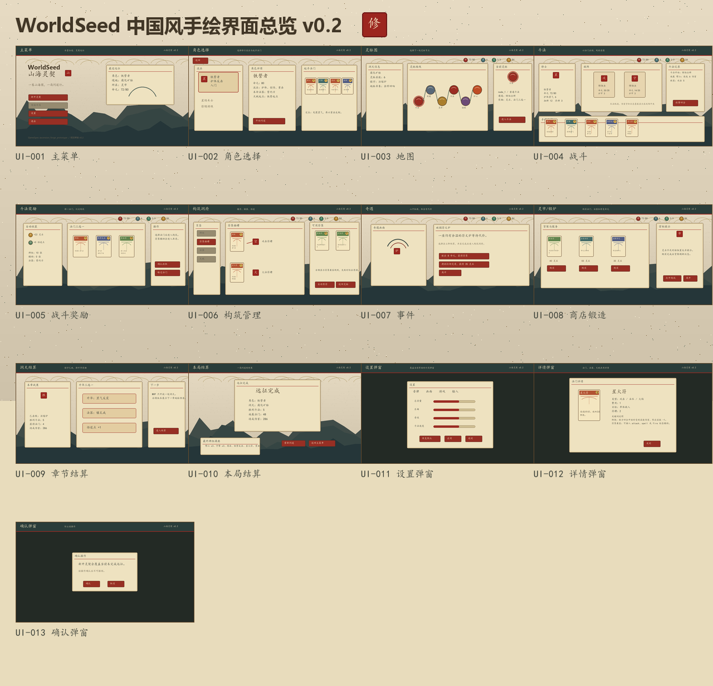

## UI-001 主菜单

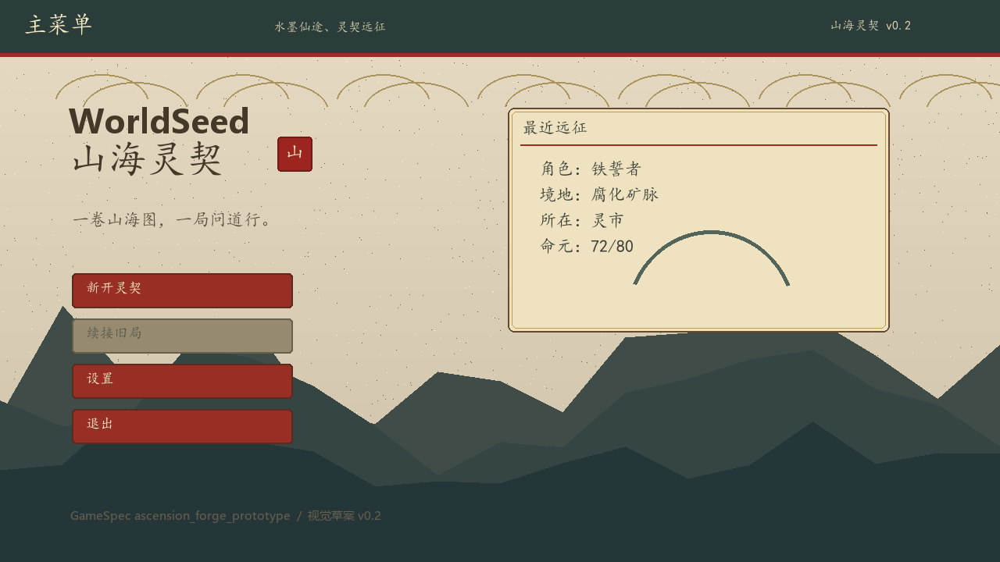

- 保留左侧纵向主操作。
- 背景改为宣纸、水墨山影和云纹。
- 主标题改为“山海灵契”方向，强调修仙题材入口。
- 按钮改为朱砂色，带手绘纸面质感。

## UI-002 角色选择

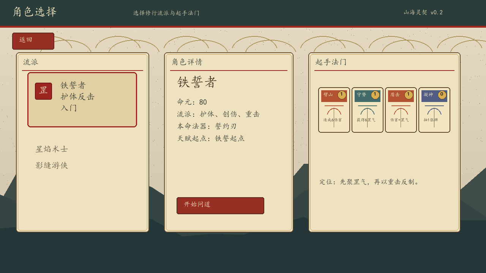

- 角色卡改为流派选择。
- 角色详情使用“命元、法器、天赋起点”等修仙表达。
- 初始牌组改为起手法门预览。

## UI-003 地图

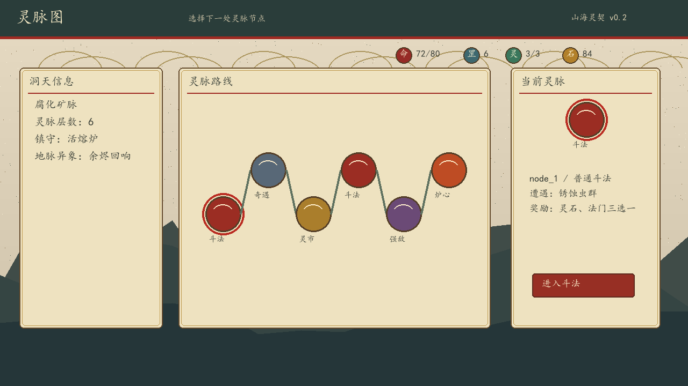

- 地图改名为“灵脉图”。
- 节点表现为灵脉珠和地脉连接线。
- 普通战斗、事件、商店、精英和 Boss 分别表达为斗法、奇遇、灵市、强敌和炉心。

## UI-004 战斗

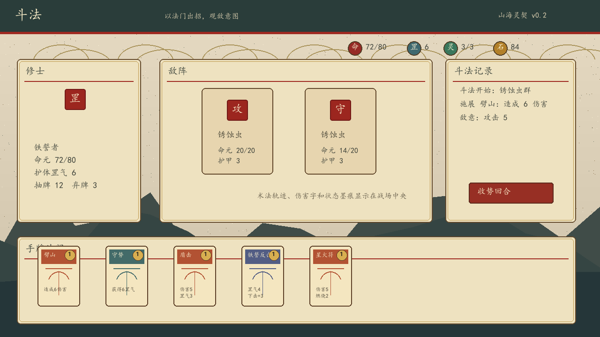

- 战斗改名为“斗法”。
- 玩家区域展示命元、护体罡气、抽牌和弃牌。
- 敌人意图使用篆印式“攻”“守”标识。
- 手牌区改为手牌法门，卡牌外观改为符箓/法门牌。

## UI-005 战斗奖励

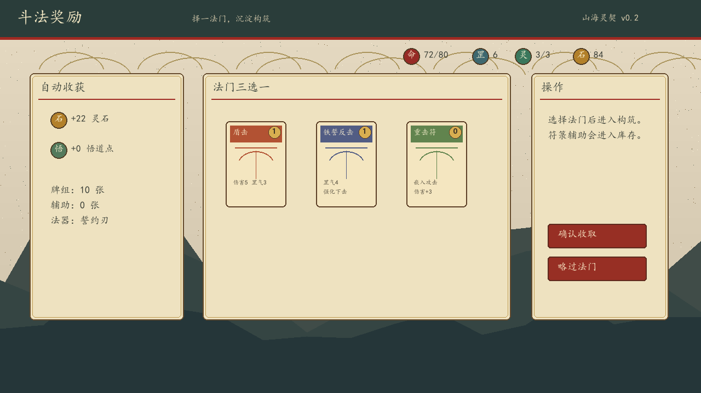

- 奖励改为灵石、悟道点、法门和符箓。
- 自动奖励、三选一奖励、确认操作维持原有功能结构。
- 选择后仍进入构筑管理。

## UI-006 构筑管理

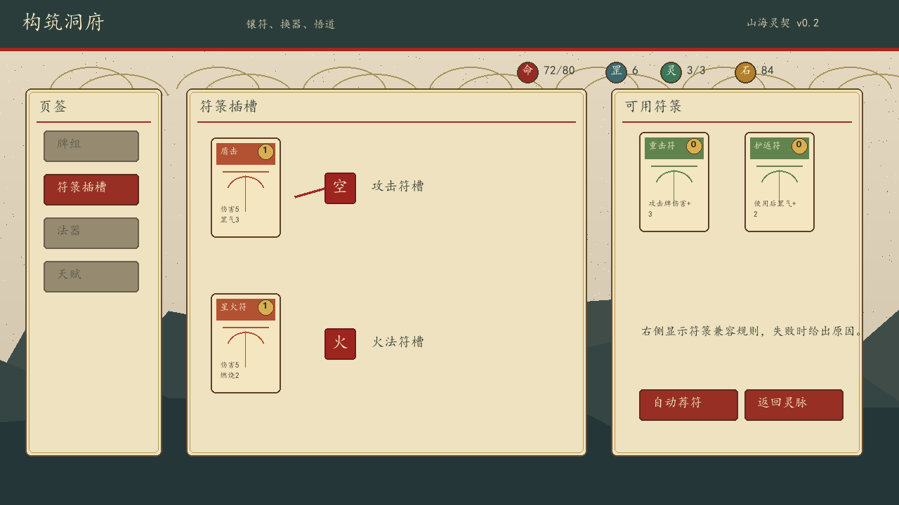

- 构筑管理改名为“构筑洞府”。
- 技能插槽改为符箓插槽。
- 辅助卡改为可嵌入法门的符箓。
- 保持左侧页签、中央连接关系、右侧详情的结构。

## UI-007 事件

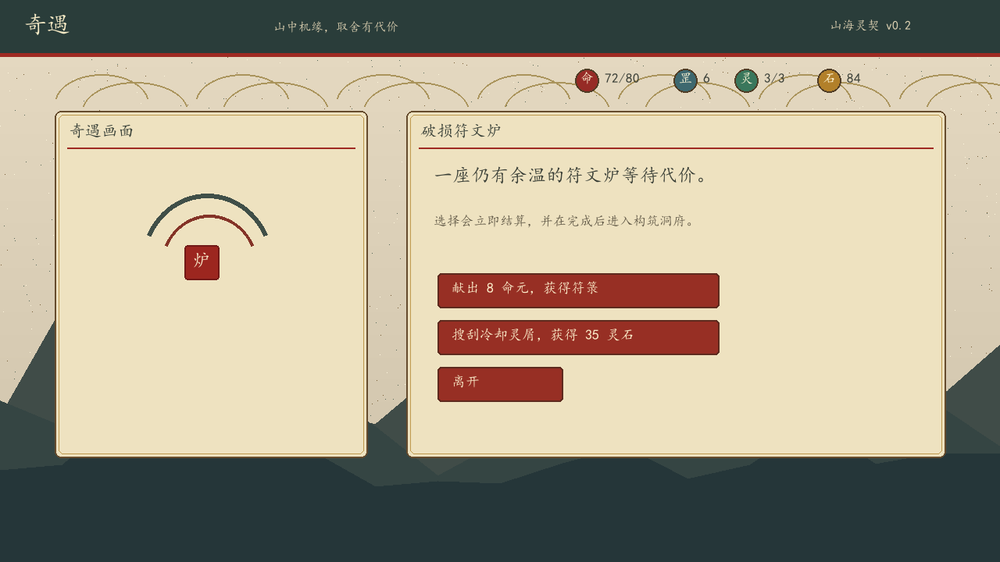

- 事件改名为“奇遇”。
- 插画区使用符文炉和水墨弧线表达。
- 选择文案改成命元、符箓、灵石等修仙语境。

## UI-008 商店/锻造

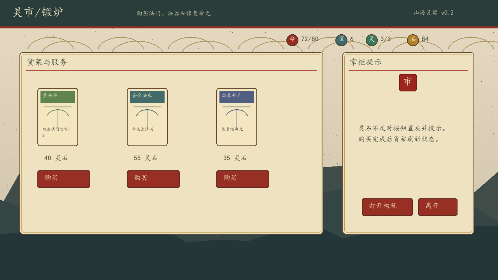

- 商店/锻造改名为“灵市/锻炉”。
- 商品展示为符箓、法衣和温养命元服务。
- 保留购买、打开构筑和离开的操作结构。

## UI-009 章节结算

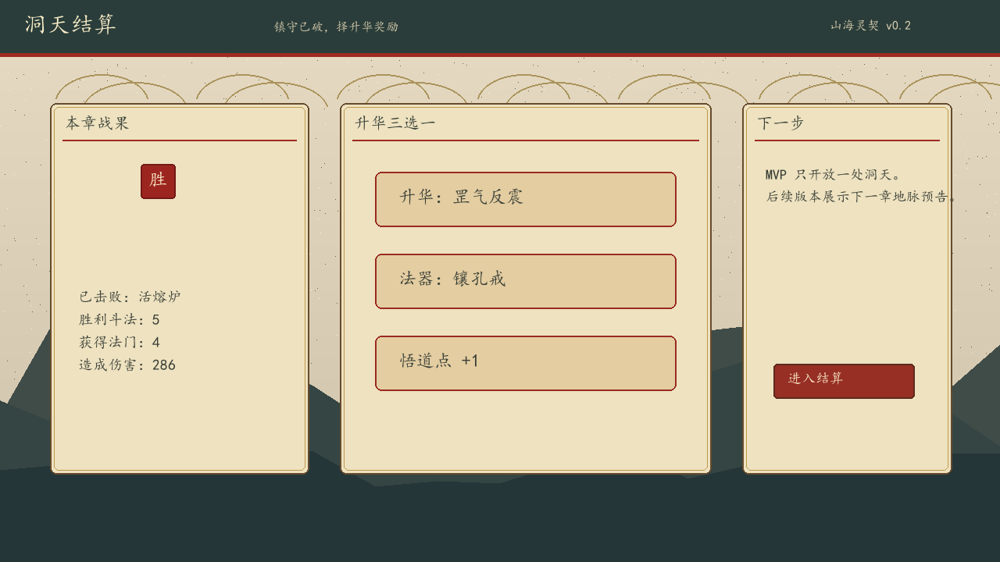

- 章节结算改名为“洞天结算”。
- 统计项使用斗法、法门、伤害等表达。
- 奖励区改成升华、法器和悟道点三选一。

## UI-010 本局结算

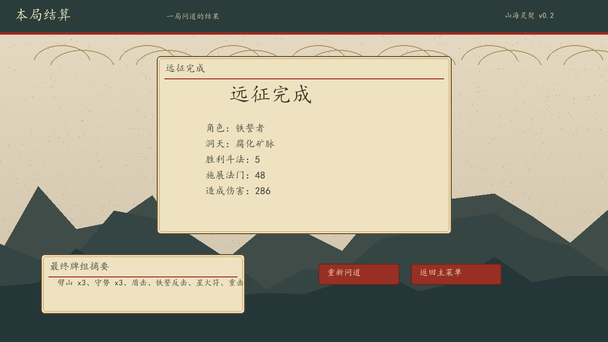

- 结算页保留中央结果卡片。
- 最终牌组摘要改成法门名称。
- 底部操作改成“重新问道”和返回主菜单。

## UI-011 设置弹窗

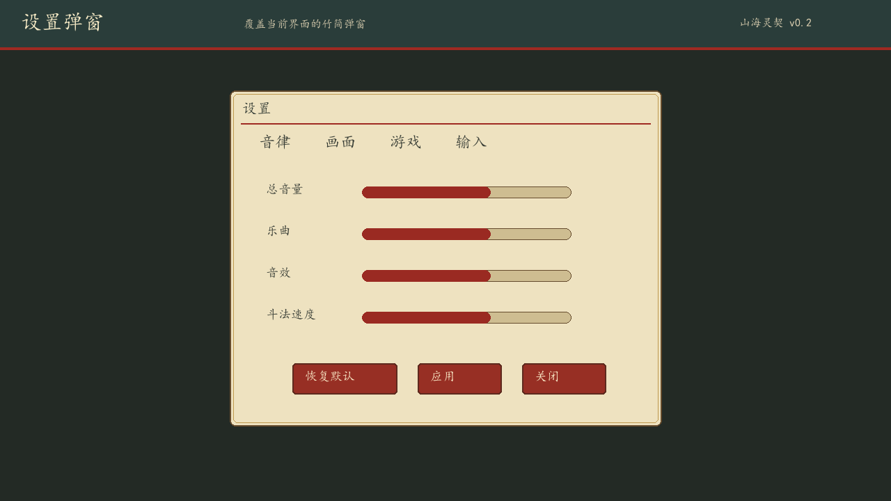

- 弹窗改成竹简/宣纸面板。
- 标签改为音律、画面、游戏、输入。
- 滑条使用朱砂填充。

## UI-012 详情弹窗

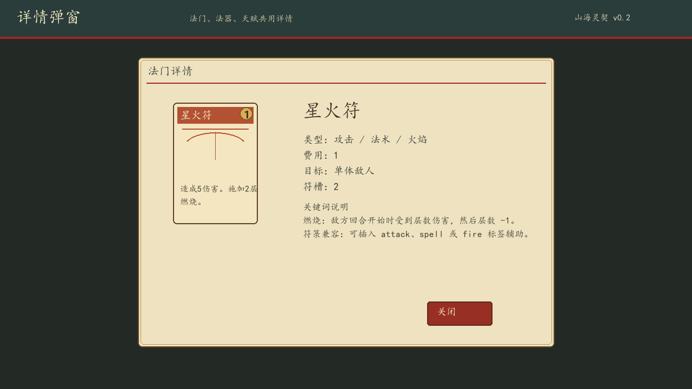

- 详情对象改为法门详情。
- 左侧展示符箓卡面。
- 右侧保留类型、费用、目标、符槽和关键词说明。

## UI-013 确认弹窗

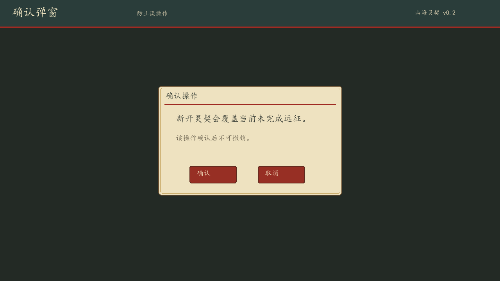

- 弹窗保持小型居中。
- 文案改成“新开灵契会覆盖当前未完成远征”。
- 确认和取消按钮使用朱砂样式。

## 待确认点

- 是否确认将 v0.2 作为后续 UI 开发目标，替代 v0.1 暗色矿脉风格。
- 是否确认主菜单标题和产品名倾向“山海灵契”。
- 是否确认玩法术语整体改成命元、灵力、灵石、法门、符箓、灵脉、洞天。
- 是否需要更偏厚涂国风，还是保持当前轻水墨手绘 UI。

## 验证

- 效果图数量：13 个界面图 + 1 个总览图。
- 每张界面图分辨率：1280x720。
- 总览图分辨率：1280x1232。
- 效果图引用路径位于 `WorldSeed.AIGC/wiki/design/images/ui-screen-mockups-v0.2/`。
