# 界面视觉效果图 v0.3

## 状态

- status: active
- source: 用户参考图、v0.2 中国风手绘修仙方向、用户确认按 v0.3 进入开发
- updated: 2026-05-16

## 结论

本页是参考用户提供的卡牌美术示例后确认的第一阶段 UI 开发目标。相比 v0.2，本版重点从“水墨 UI 氛围”推进到“卡牌框、费用宝珠、门类竖条、属性配色、卡面展示”的具体美术语言。

## 参考方向

本版只参考用户图片中的美术语言，不复刻其中具体角色、卡牌名称、图案或构图。

保留的方向：

- 宣纸底、卷轴线、细装饰标题。
- 中国风手绘卡牌。
- 竖向门类条。
- 左上费用宝珠。
- 彩色卡框区分门类和属性。
- 卡面插画区 + 底部规则文本区。
- 稀有度、属性和角标可拆成独立 UI 元素。

## 总览

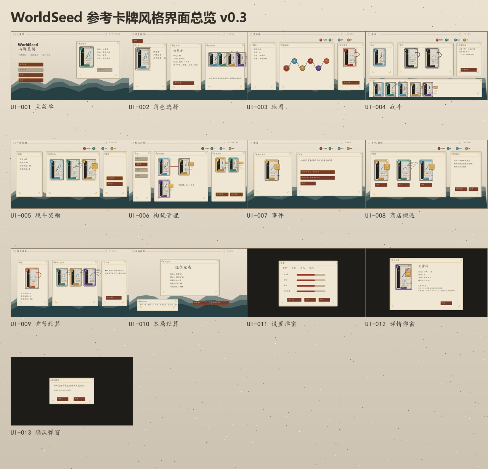

## 卡牌与 UI 元素参考

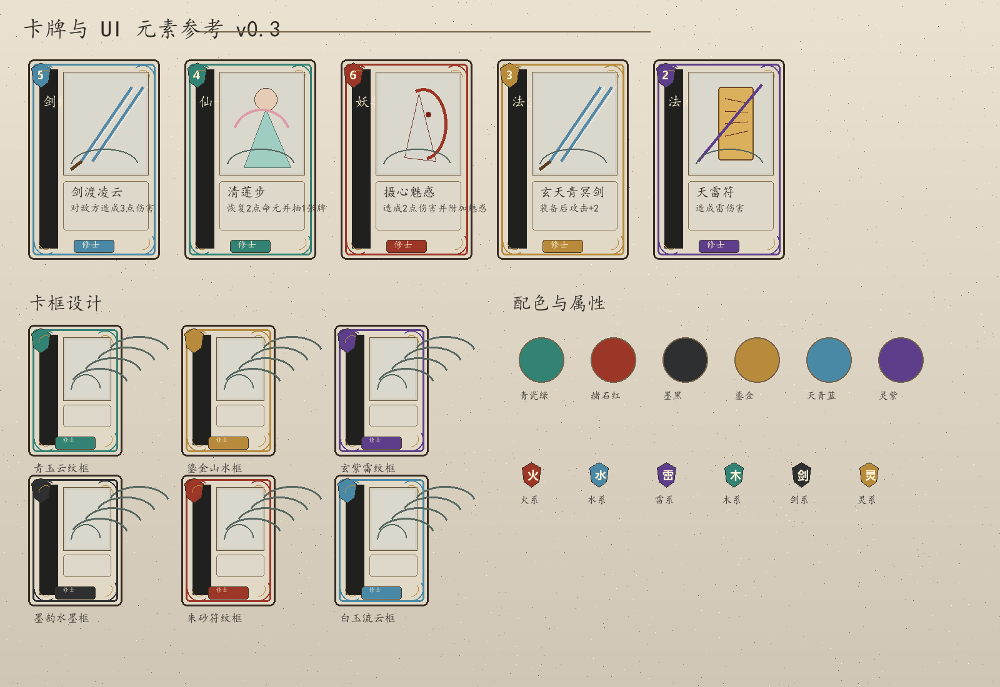

- 卡牌示例覆盖剑修、仙子、妖兽、法宝、法术。
- 卡框示例覆盖青玉、鎏金、玄紫、墨韵、朱砂、白玉等方向。
- 配色示例覆盖青瓷绿、赭石红、墨黑、鎏金、天青蓝、灵紫。
- 属性示例覆盖火、水、雷、木、剑、灵。

## UI-001 主菜单

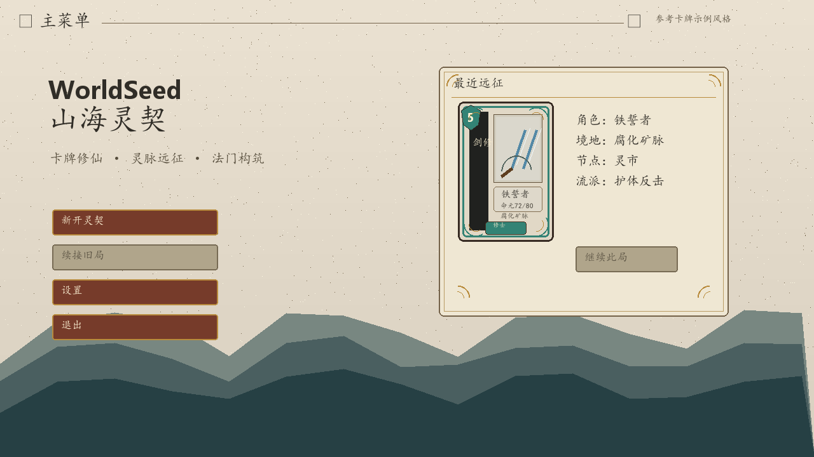

- 左侧保留主操作。
- 右侧最近远征改为一张角色卡式摘要。
- 页面底部使用山水层次承接整体视觉。

## UI-002 角色选择

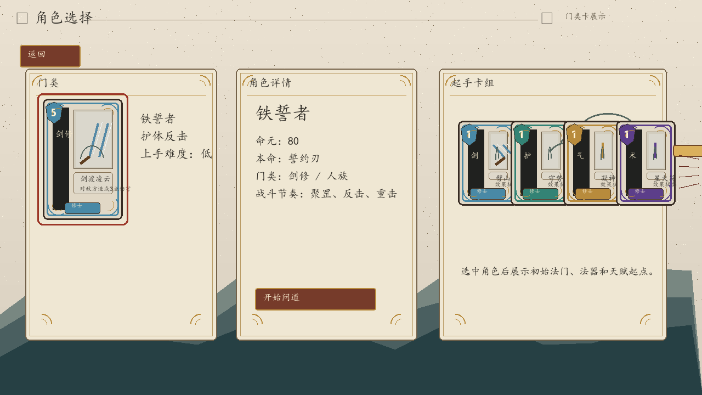

- 角色选择以大卡牌展示当前角色。
- 起手卡组使用小卡牌横排预览。
- 角色详情保持文字信息，但视觉优先级低于角色卡。

## UI-003 地图

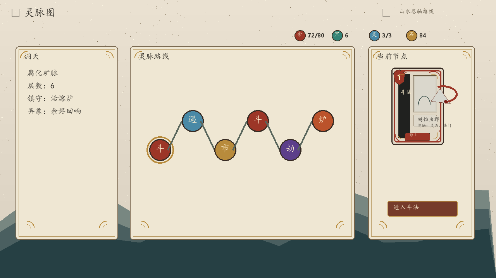

- 地图仍为灵脉路线。
- 当前节点详情使用一张遭遇卡展示。
- 节点用属性色圆点区分斗法、奇遇、灵市、强敌和炉心。

## UI-004 战斗

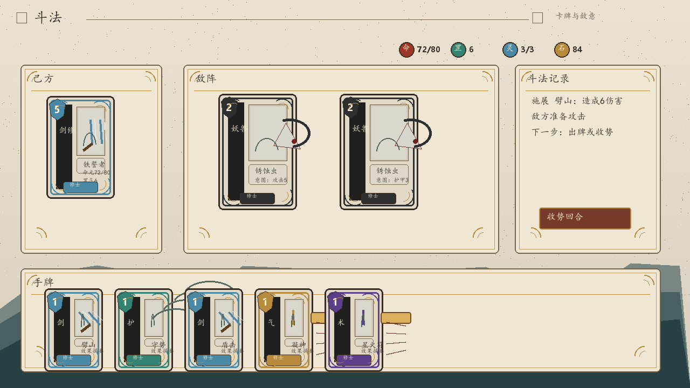

- 玩家和敌人都以卡片化单位展示。
- 手牌使用更接近参考图的卡牌框、费用宝珠和门类竖条。
- 右侧保留斗法记录和回合结束操作。

## UI-005 战斗奖励

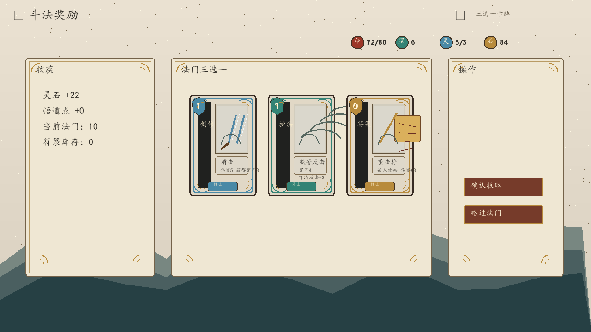

- 中央三选一奖励改为大卡牌。
- 左侧展示自动收获。
- 右侧保留确认和跳过。

## UI-006 构筑管理

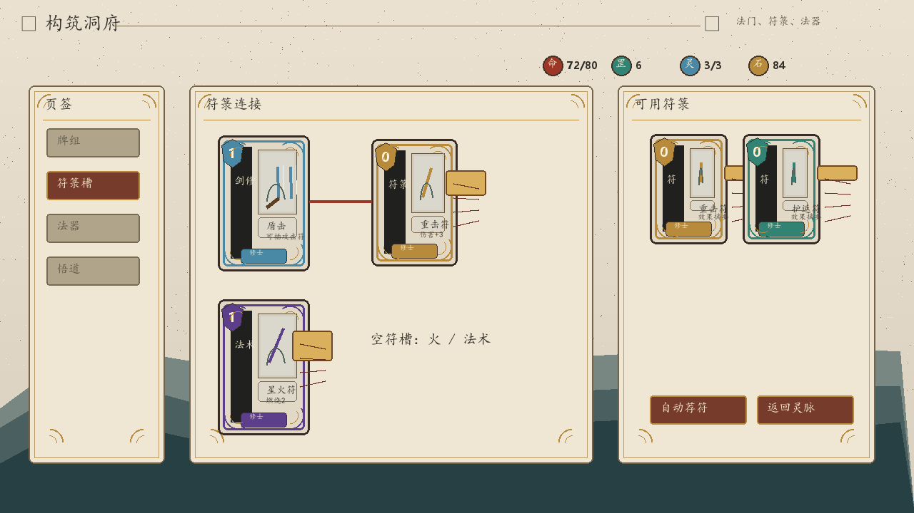

- 法门和符箓都使用卡牌展示。
- 中央通过连线表达符箓插入关系。
- 右侧展示可用符箓小卡。

## UI-007 事件

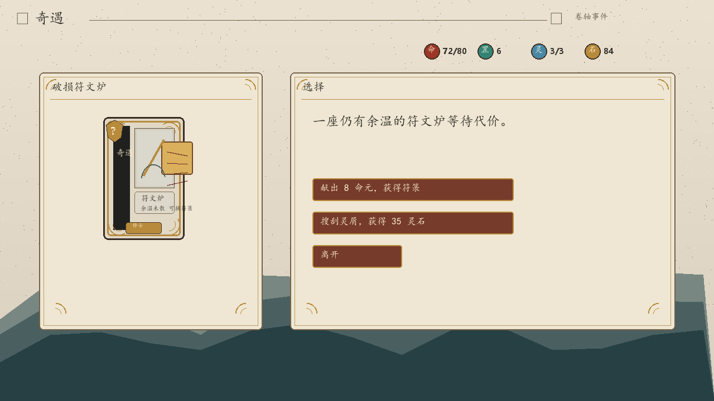

- 奇遇本体以事件卡展示。
- 右侧保留事件文本和选择按钮。
- 适合后续替换为正式事件插画。

## UI-008 商店/锻造

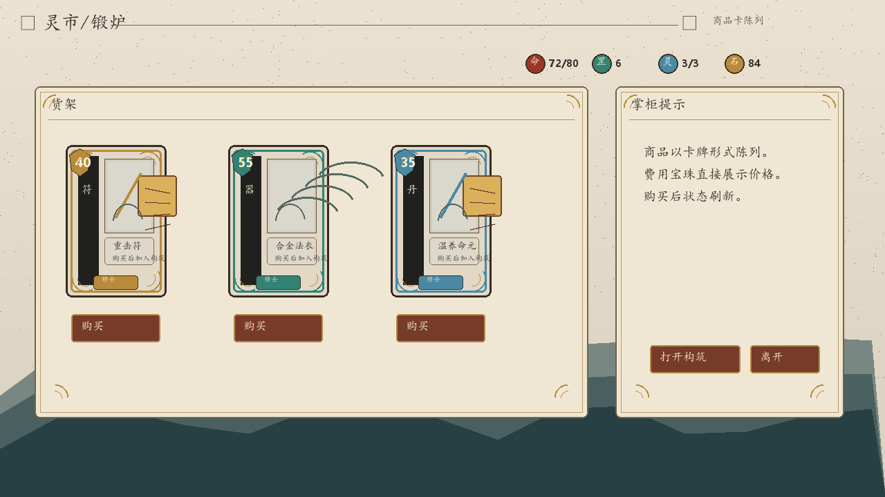

- 商品以卡牌方式陈列。
- 费用直接放在卡牌费用宝珠中。
- 购买按钮位于商品卡下方。

## UI-009 章节结算

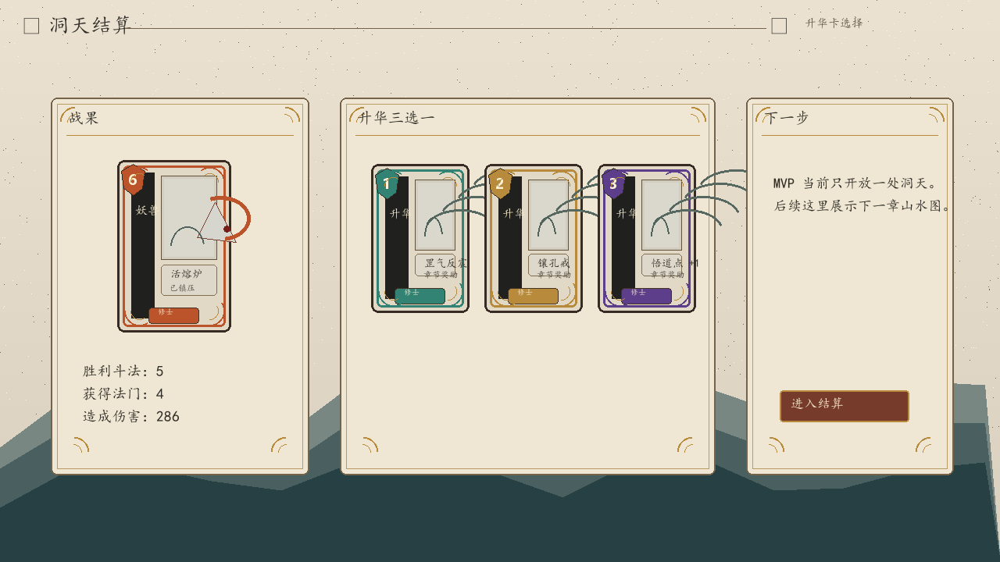

- Boss 战果以卡片展示。
- 升华奖励三选一使用小卡形式。
- 右侧保留下一步说明。

## UI-010 本局结算

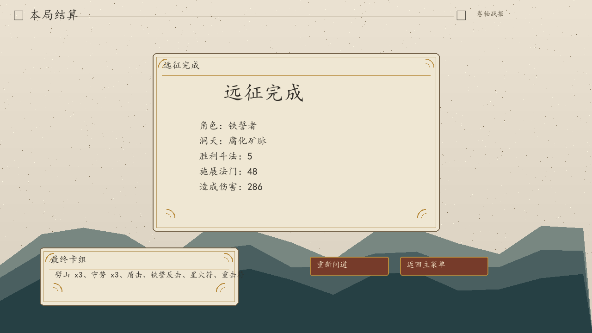

- 中央为卷轴战报面板。
- 最终卡组摘要保留在左下。
- 底部提供重新问道和返回主菜单。

## UI-011 设置弹窗

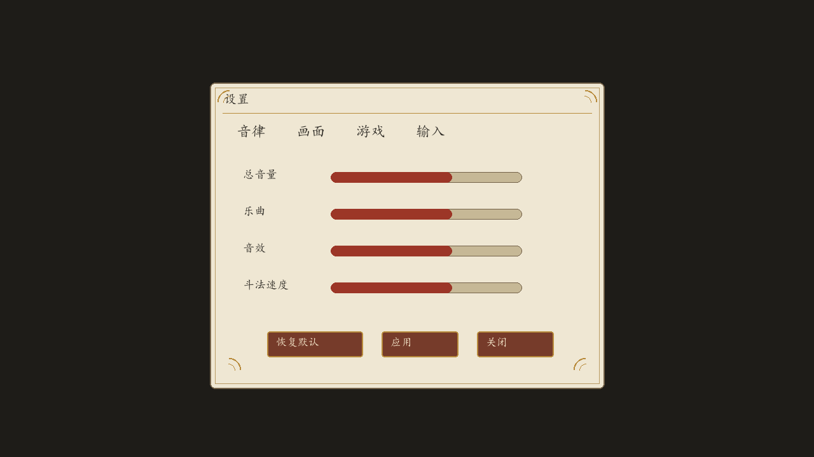

- 弹窗仍使用卷轴面板。
- 视觉上和主界面统一，但不抢占卡牌视觉焦点。

## UI-012 详情弹窗

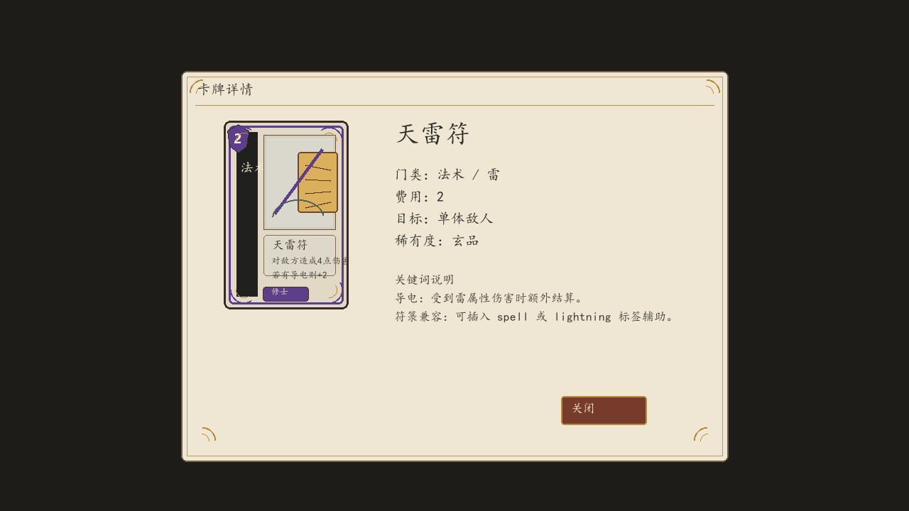

- 左侧展示完整大卡。
- 右侧展示门类、费用、目标、稀有度和关键词说明。
- 该界面后续可作为所有卡牌、装备、天赋详情共用模板。

## UI-013 确认弹窗

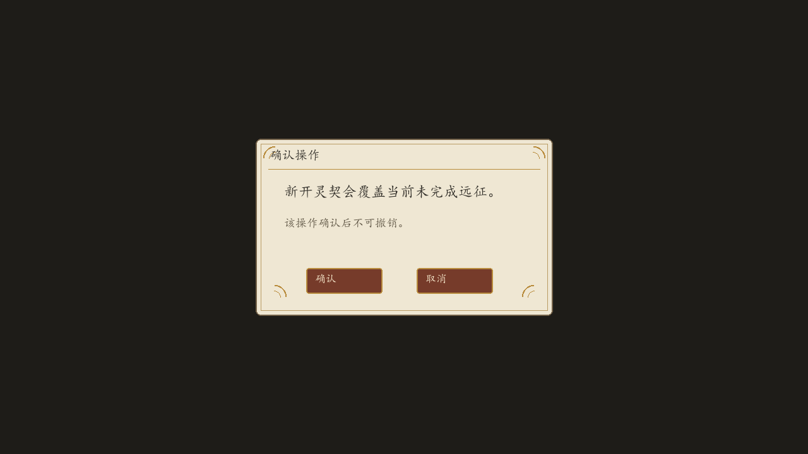

- 小型弹层保留简洁确认结构。
- 按钮沿用朱砂/金线样式。

## 已确认点

- v0.3 替代 v0.2，作为后续 UI 开发目标。
- 卡牌使用“左上费用宝珠 + 左侧门类竖条 + 插画区 + 规则区”的固定结构。
- 角色、敌人、商品、事件、升华奖励尽量卡片化展示。

## 后续待拆分

- 正式美术资产需要拆成：卡框、费用宝珠、门类条、稀有度徽章、属性徽章、插画、面板、按钮、卷轴背景。
- Godot 实机实现后需要补充实机截图验证。

## 验证

- 效果图数量：13 个界面图 + 1 个总览图 + 1 个卡牌与 UI 元素参考图。
- 每张界面图分辨率：1280x720。
- 总览图分辨率：1280x1232。
- 卡牌与 UI 元素参考图分辨率：1600x1100。
- 效果图引用路径位于 `WorldSeed.AIGC/wiki/design/images/ui-screen-mockups-v0.3/`。
